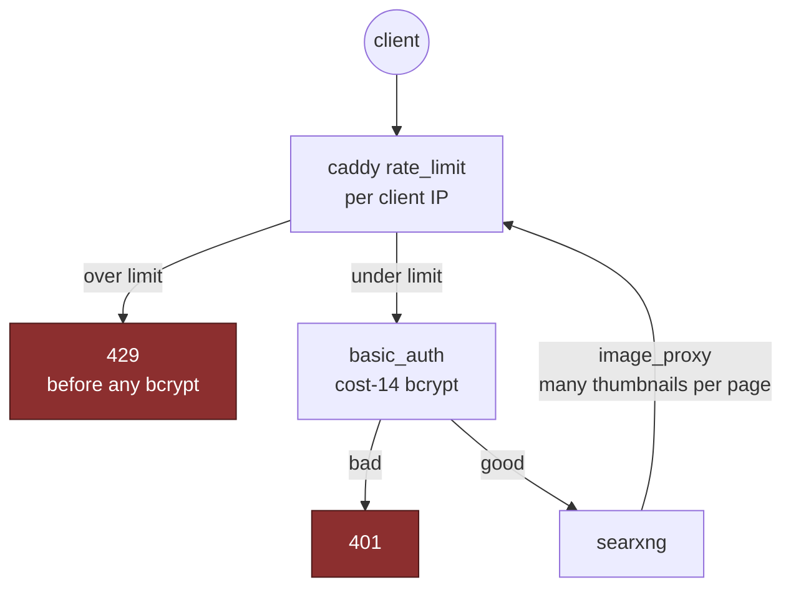

# Access control

Every service has exactly one gate, and they differ by what the service itself
supports.

| Service        | Gate                                                                                                                                            |
| -------------- | ----------------------------------------------------------------------------------------------------------------------------------------------- |
| grafana        | real login from sops; anonymous-Admin off, sign-up off                                                                                          |
| dozzle         | bcrypt hash from sops, in a `users.yml` copied to a stable path                                                                                 |
| minecraft RCON | password from sops, loopback only; one password per world (25575 / 25576)                                                                       |
| serenity bot   | discord token + AI key + db password, all sops                                                                                                  |
| **kuma**       | **no seeding mechanism** — the first visitor creates the admin account and the route then closes. Create it immediately after the first deploy. |
| **searxng**    | **no accounts at all** — caddy's `basic_auth` is the entire access control; the bcrypt hash is a sops secret handed to caddy via an env file    |

## searxng, the interesting one

It has no concept of a user, so authentication is the proxy's job — and that
turns out to have a second-order problem.

- caddy's `basic_auth` on the `search.` site is the only thing between the
  instance and the internet. The credential is passed through caddy's own
  `{$VAR}` env substitution from a sops-rendered env file — **not** a Nix
  string, because the Caddyfile is a world-readable store path and a bcrypt
  hash there is one anyone with a shell could crack.
- basic_auth runs a **cost-14 bcrypt on every request**, and searxng's
  `image_proxy` pulls many thumbnails per results page _through_ caddy — so a
  password flood could turn bcrypt into CPU exhaustion. caddy's `rate_limit`
  (the compiled-in module) caps hits per client IP and returns 429 **before**
  the bcrypt runs, ordered `before basic_auth`.

The choice of an in-process limiter over a fail2ban jail is deliberate, and it
is the same lesson as
[the fail2ban blast radius](../operations/recovery.md#the-fail2ban-blast-radius):
a misconfigured rate limiter throttles requests, it cannot take the box down.

The env file is read by docker at container _start_, so it re-resolves the sops
generation symlink each time. A _mounted_ template would pin a stale inode —
see [Secrets](secrets.md#the-stale-symlink-trap).
