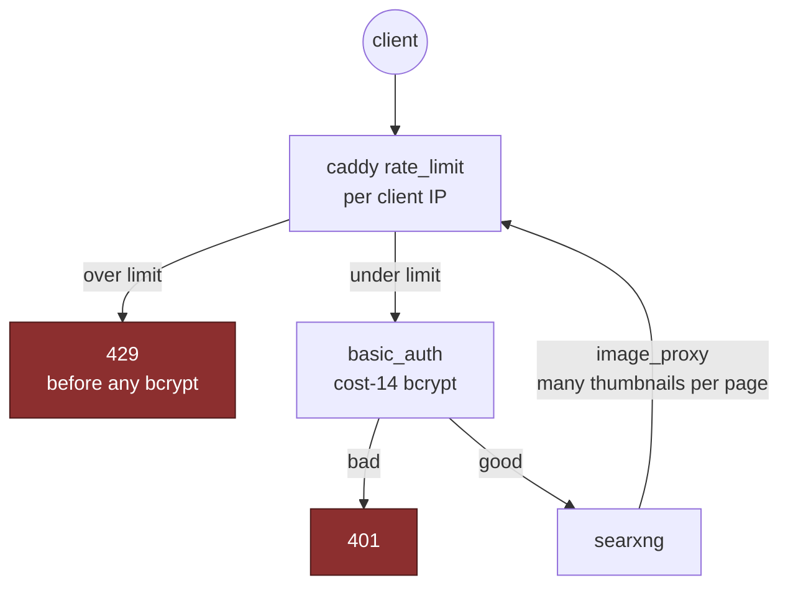

# Access control

Every service has exactly one gate, and they differ by what the service itself
supports.

| Service        | Gate                                                                                                                                            |
| -------------- | ----------------------------------------------------------------------------------------------------------------------------------------------- |
| grafana        | real login from sops; anonymous-Admin off, sign-up off                                                                                          |
| dozzle         | bcrypt hash from sops, in a `users.yml` copied to a stable path                                                                                 |
| minecraft RCON | password from sops, loopback only; one password per world (25575 / 25576)                                                                       |
| serenity bot   | discord token + AI key + db password, all sops                                                                                                  |
| **kuma**       | **no seeding mechanism** — the first visitor creates the admin account and the route then closes. Create it immediately after the first deploy. |
| **searxng**    | **no accounts at all** — caddy's `basic_auth` is the entire access control; the bcrypt hash is a sops secret handed to caddy via an env file    |

## Site administration is tailnet-only

Where an app's administration lives on paths its public side never uses, caddy
answers those paths with a 404 on the public listener and serves the same name
again on the tailnet listener with them open (`blockedPaths` in
`modules/containers/caddy.nix`). Tailnet devices resolve those names to the
tailnet address through
[split DNS](tailnet.md#split-dns-for-the-half-public-names), so the admin side
works from any of them with nothing configured per device.

- **kuma** — `/socket.io/` is only the admin login and dashboard; the public
  status page loads everything from `/api/status-page/*`. kuma's login is a
  message inside that socket, so no HTTP rate limit can count attempts at it:
  not exposing the socket is the only real second layer.
- **Forgejo** — `/admin` (the site admin panel) and `/api/v1/admin/*` (its
  API: users, orgs, runner tokens, cron, system webhooks). Personal and org
  settings stay public. A stolen password or session can still use what the
  account owns, but not administer the instance from outside the tailnet.
  Forgejo also routes `//admin` and `/api//v1/admin/*` to the same handlers;
  caddy's path matcher merges slashes, and a local replay confirmed those 404
  too.

The block is its own `handle`, not a bare `respond`: caddy orders `handle`
before `respond`, and the git site's upstream sits inside handle blocks for
the runner restriction, so a bare `respond` there would never run.

## Rate limiting, every site by default

Every caddy site is rate-limited unless it sets `rateLimit = null`, and none
does. It used to be opt-in, and only `search.` had opted in, which left the
logins on `music.`, `mail.` and `git.` open to guessing at whatever speed each
app allowed — Forgejo allows any. Up to three zones per site, all keyed on the
client IP (`modules/containers/caddy.nix`):

- **Site-wide** — a flood brake: 300 a minute by default; `git.` 600;
  `music.`, `grafana.` and `syncthing.` 1200; `search.` 120. Private ranges,
  this host's public address and the CI runners are exempt, so kuma, renovate,
  pages-pull and CI are never throttled.
- **Login** — 10 POSTs a minute to the login request, with **no** exemptions:
  Roundcube `/?_task=login`, Forgejo `/user/login` (and two-factor,
  forgot-password, sign-up), Navidrome `/auth/login`. Nothing on this host
  posts to a login form, so a private source here can only be a masked client,
  and a shared bucket failing closed is the right answer.
- **Basic auth** — `git.` only: 30 a minute for requests carrying
  `Authorization: Basic`, which is how a password reaches Forgejo over git or
  the API without ever touching `/user/login`. Exempt like the site-wide zone,
  because renovate pushes with its token as a basic-auth password.

These are one layer, not the only one. Roundcube also locks an account after 3
failures a minute; Navidrome 0.64.1 throttles failed Subsonic logins itself;
searxng's bcrypt sits behind the limit. Forgejo has no throttle of its own, so
two-factor auth on the account is its second layer.

The mail protocols (465, 587, 993) never pass through caddy. Their only
brute-force control is docker-mailserver's own fail2ban: six failures in a week
buy a week's ban. Its exemption list is widened to every docker network by a
mounted `fail2ban-jail.cf`, because Roundcube's IMAP logins arrive from a
docker address — without it, six wrong webmail passwords would ban Roundcube
itself and take webmail down for everyone.

## searxng, the interesting one

It has no concept of a user, so authentication is the proxy's job — and that
turns out to have a second-order problem.

- caddy's `basic_auth` on the `search.` site is the only thing between the
  instance and the internet. The credential is passed through caddy's own
  `{$VAR}` env substitution from a sops-rendered env file — **not** a Nix
  string, because the Caddyfile is a world-readable store path and a bcrypt
  hash there is one anyone with a shell could crack.
- basic_auth runs a **cost-14 bcrypt on every request**, and searxng's
  `image_proxy` pulls many thumbnails per results page _through_ caddy — so a
  password flood could turn bcrypt into CPU exhaustion. caddy's `rate_limit`
  (the compiled-in module) caps hits per client IP and returns 429 **before**
  the bcrypt runs, ordered `before basic_auth`.

The choice of an in-process limiter over a fail2ban jail is deliberate, and it
is the same lesson as
[the fail2ban blast radius](../operations/recovery.md#the-fail2ban-blast-radius):
a misconfigured rate limiter throttles requests, it cannot take the box down.

The env file is read by docker at container _start_, so it re-resolves the sops
generation symlink each time. A _mounted_ template would pin a stale inode —
see [Secrets](secrets.md#the-stale-symlink-trap).
