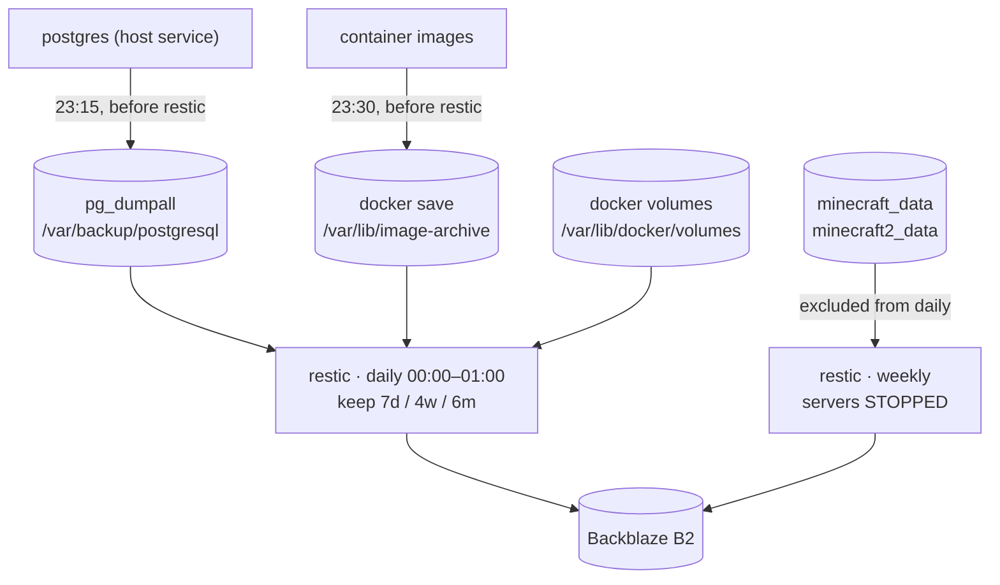

# Data and backups



## Wholesale, not per service

`services.restic` backs up `/var/lib/docker/volumes` **wholesale**, so a
service added later is covered the moment it declares a volume. A backup that
has to be told about each new service eventually stops covering one. The same
rule shapes the other two paths: both are generated from what the configuration
already declares, never from a hand-maintained list.

postgres runs on the host, so its data is not under `docker/volumes`;
`services.postgresqlBackup` writes a `pg_dumpall` (every database plus globals)
there at **23:15**, deliberately before restic's window, so the archived dump
is never up to 23 hours stale.

## The image archive

The third path is not data — it is the **bytes of every container image**, and
it exists because a registry reference is not a guarantee that the bytes are
still there.

This estate has already been bitten. forgejo **16.0.2 is unpullable**: the tag
still resolves on codeberg, but a platform manifest inside the index was
deleted, so a rebuild from scratch cannot reach it. That was a release tag, not
a rolling one, which is the part that matters — pinning a digest does not cause
this and staying on a tag does not prevent it. The only thing that helps is
owning a copy.

So `modules/image-archive.nix` runs `docker save` over every **pullable** image
at **23:30**, into a directory the daily restic job already ships to B2. 23:30
is the same reasoning as `postgresqlBackup` at 23:15: an archive written after
the backup window reaches B2 a day late.

Locally built images are excluded, because a `docker pull` can never satisfy
one and each already has a unit that produces it — `caddy` and `pages-hook`
(`imageFile`, built by dockerTools) and `serenity-bot-*`. `serenity-redis` is
**not** in that set: it runs a registry image and is covered like everything
else.

### Restoring is automatic

Each pullable container's unit gained an `ExecStartPre` that resolves its image
in four steps, and only reaches the last two when the ones above have failed:

```text
already present  →  docker pull  →  the archive on disk  →  restic restore
```

Digest pinning is what makes that fallback **sound** rather than merely
convenient: a pinned pull either returns those exact bytes or fails, so
"pull, else restore" can never quietly substitute a different image. With a
floating tag it could. See
[the service stack](services.md#images-are-pinned-where-the-tag-moves).

The restore names `--path /var/lib/image-archive` rather than taking a bare
`latest`, because this repository also holds the weekly Minecraft job's
snapshots and those carry no archive at all.

### Not compressed, deliberately

`docker save` already emits the layer blobs the way the registry stores them,
so zstd measured **38 M → 38 M** on redis. Worse, one compressed stream per
archive would defeat restic's content-defined deduplication — which is what
makes a nightly copy of 2.6 G nearly free and lets the two Minecraft images
share their common base layers.

## The Minecraft worlds are a separate job

They are snapshotted **with the servers stopped** — a live world holds region
files open and is not consistent on disk. That job stops the containers in
`backupPrepareCommand` and restarts them from `backupCleanupCommand` (an
`ExecStopPost`), so the servers return whether restic succeeded or not.

Both worlds share **one** job, and therefore one downtime window: a second job
would mean a second stop/start cycle and a second restic run against the same
repository.

> **Every world volume must be in this job's `paths` _and_ in the daily job's
> `exclude`.** A volume missing from the exclude list is archived hot by the
> daily run, which is exactly the corruption this job exists to prevent.

## The password is the key

The restic **password is the encryption key**: lose it and every snapshot is
unrecoverable. It, and the other things that deliberately live outside this
repo, are catalogued in the README's "Not in this repo" section.

## What the runner holds

Nothing that is backed up, and that is the point. The runner's state is a nix
store and an Actions cache — both reconstructible, both worthless to an
attacker, neither in any restic job. A runner is replaced, not restored. See
[CI runner isolation](runner.md).
