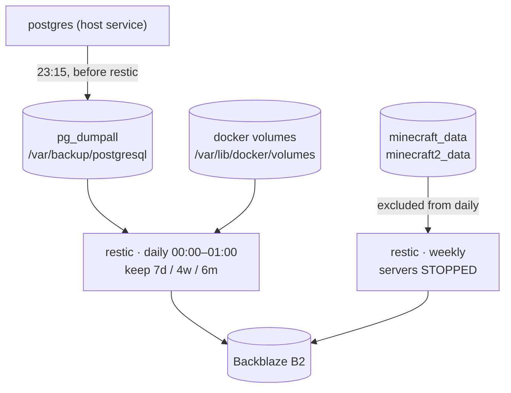

# Data and backups

## Wholesale, not per service

`services.restic` backs up `/var/lib/docker/volumes` **wholesale**, so a
service added later is covered the moment it declares a volume. A backup that
has to be told about each new service eventually stops covering one.

postgres runs on the host, so its data is not under `docker/volumes`;
`services.postgresqlBackup` writes a `pg_dumpall` (every database plus globals)
there at **23:15**, deliberately before restic's window, so the archived dump
is never up to 23 hours stale.

## The Minecraft worlds are a separate job

They are snapshotted **with the servers stopped** — a live world holds region
files open and is not consistent on disk. That job stops the containers in
`backupPrepareCommand` and restarts them from `backupCleanupCommand` (an
`ExecStopPost`), so the servers return whether restic succeeded or not.

Both worlds share **one** job, and therefore one downtime window: a second job
would mean a second stop/start cycle and a second restic run against the same
repository.

> **Every world volume must be in this job's `paths` _and_ in the daily job's
> `exclude`.** A volume missing from the exclude list is archived hot by the
> daily run, which is exactly the corruption this job exists to prevent.

## The password is the key

The restic **password is the encryption key**: lose it and every snapshot is
unrecoverable. It, and the other things that deliberately live outside this
repo, are catalogued in the README's "Not in this repo" section.

## What the runner holds

Nothing that is backed up, and that is the point. The runner's state is a nix
store and an Actions cache — both reconstructible, both worthless to an
attacker, neither in any restic job. A runner is replaced, not restored. See
[CI runner isolation](runner.md).
