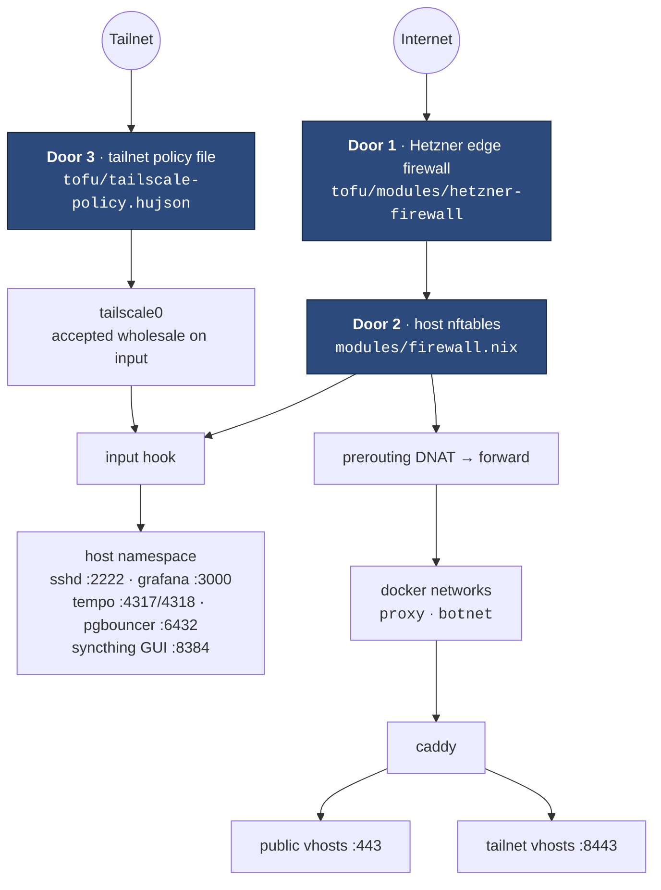
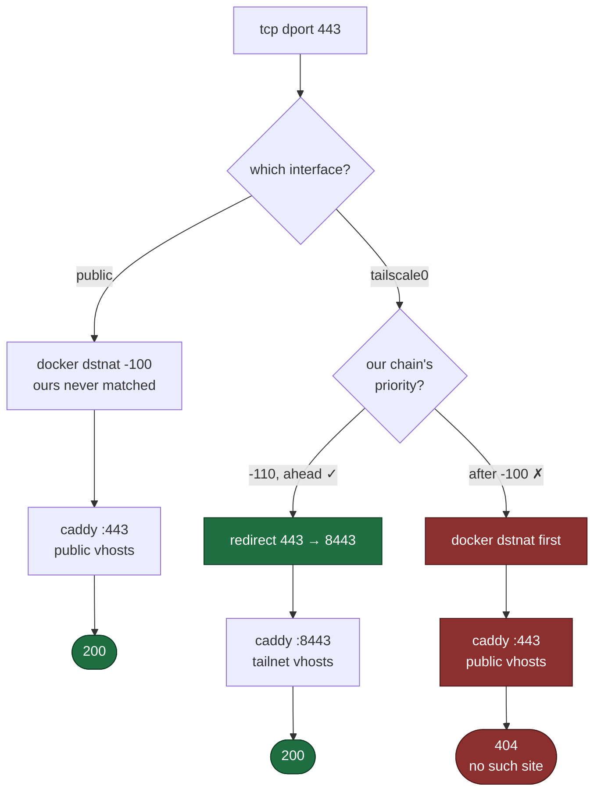

# Network and trust boundaries

Traffic reaches the VPS through three doors, and each service sits behind
exactly one of them.



## The two firewalls

The edge firewall (`tofu/`) and the host firewall (`modules/firewall.nix`) are
kept deliberately similar: **each is what survives a misconfiguration of the
other.** A port opened at one but not the other is still closed. When something
is unreachable, check both.

## input vs forward — the single most load-bearing fact

A published container port is **DNAT'd in prerouting and then forwarded** — it
never touches the input hook. Docker writes its own accepts into the
`ip filter` table; in nftables _every_ table's chain runs, and an accept in
docker's table cannot rescue a packet that `table inet nixos-fw` drops. So:

- A service's **published port belongs in the forward allow-list**, not input.
  Getting it backwards yields a port the internet can reach that the firewall
  never authorised.
- **Host-namespace services** (sshd on 2222, grafana, tempo, pgbouncer,
  syncthing) are on the **input** hook.
- `networking.nftables.flushRuleset` **must stay false**. The default flushes
  the entire ruleset — including the tables docker owns — on every reload, and
  docker only rebuilds them when `dockerd` starts. The symptom is latent:
  running containers keep working, the _next_ container start fails with
  `iptables: No chain/target/match by that name`, and recovery is
  `systemctl restart docker`.

This boundary is also why fail2ban jails for containerised services set
`chain_hook = forward`, which carries a sharp edge of its own — see
[Failure modes](../operations/recovery.md#the-fail2ban-blast-radius).

## Docker networks

| Network  | Subnet                   | Purpose                                                                                                                                                                                         |
| -------- | ------------------------ | ----------------------------------------------------------------------------------------------------------------------------------------------------------------------------------------------- |
| `proxy`  | docker's pool            | caddy resolves its upstreams here by container name over docker's embedded DNS — no IP addresses in the Caddyfile                                                                               |
| `botnet` | `172.30.0.0/24` (pinned) | the discord bot + its redis, isolated from the proxy. Pinned because `infra.botGateway` (172.30.0.1) is a literal in the bot's `DATABASE_URL`, its OTLP endpoint, and the firewall's input rule |

`modules/containers/default.nix` creates each network as a oneshot systemd unit
that every container on it `requires`, so a container can never start onto a
network that does not exist yet.

`infra.dockerBridgeGateway` (172.17.0.1) is a third address that matters: it is
how a container reaches a service in the **host's** network namespace, which is
what caddy does for grafana:3000 and syncthing's GUI:8384. It is **observed,
not enforced** — deliberately not pinned with the daemon's `bip` setting, even
though pinning is what `botSubnet`/`botGateway` do for a network this repo
creates itself. `bip` is daemon config, so setting it restarts `docker.service`,
which stops every container. A wrong value here costs one failed container
start and a rollback; pinning it costs a full container restart on every deploy
that touches the line.

The input rule that makes that route work is
`iifname "br-*" ip saddr != 172.30.0.0/24 tcp dport { 3000, 8384, 8443 }`, and
the exclusion is the point. The rule above it grants the bot exactly two ports
(4317, 6432) from exactly `botSubnet`; without the `!=`, this one immediately
handed the same bridge three more, so a narrow grant was followed by a broad one
and only the broad one meant anything. The bot is the right container to
subtract first — it is the only one here whose input is arbitrary text from
strangers that it then ships to a third-party model.

What remains matched is **deliberate and worth knowing**: searxng, kuma,
forgejo, navidrome and the two minecraft servers share the proxy bridge with
caddy, so they are still admitted to those three ports. Both services behind
them are credential-protected (grafana has a real admin login with sign-up off;
syncthing's GUI password is declared by `modules/syncthing.nix` through
`guiPasswordFile` and re-applied on every deploy), so this is defence in depth,
not a hole being closed.

That syncthing half used to be an **assertion about the live box** rather than
something the deploy enforced. The config directory came across from the old
host with a password already set by hand, and nothing in the repo would have
noticed its absence: on fresh state syncthing comes up with a generated API key
and **no password at all**, bound to `0.0.0.0` and reachable from every bridge
in the list above. That mattered more than a login form normally does, because
syncthing's REST API is not a viewer — `/rest/config/folders` takes a
versioning block of type `external` with a `params.command` that syncthing
execs, and a folder rooted at `~/.ssh` writes `authorized_keys` as `hutao`, who
has passwordless sudo. The credential is now declarative, so it fails closed.

Subtracting the rest needs a **positive** source match, which needs a
pinned subnet on `proxy`, which means deleting a network that already exists and
detaching every container on it — a maintenance window, not an edit.

One silent consequence of adding `ip saddr`: the rule is now **IPv4-only**,
where the bare version matched both families. That is free today because
docker's bridges here carry no IPv6, but turning on docker IPv6 would need an
`ip6 saddr !=` sibling or those three ports go dark over v6 with every other
check still passing.

## Tailscale

The tailnet interface is accepted **wholesale** on the input hook, which is how
the tailnet-only services (grafana, tempo, dozzle, pgbouncer, syncthing GUI)
are kept private — by the _absence_ of an internet rule, not by their bind
address. Several bind `0.0.0.0` and rely entirely on this.

That is also why door 3 is a policy file and not an nftables rule. **nftables
cannot tell tailnet peers apart**: every packet off `tailscale0` looks the same
to it, so "which peers may reach what" is a question this layer is structurally
unable to answer. `tofu/tailscale-policy.hujson` is the layer that can, and it
narrows the VPS to nine ports for the owner account — 6432 and 4317/4318 are
no longer tailnet-reachable at all. See
[The tailnet policy](tailnet.md).

Tailscale SSH is **off** (`tailscale set --ssh=false`). With it on, tailscaled
owned port 22 on the tailnet address, and once split DNS sent `git.` there on
tailnet devices, git over ssh landed on Tailscale SSH instead of forgejo.
Administration, deploys and the runner's jump hop all use sshd on 2222 with an
ordinary key.

Three of those services also answer by name — `dozzle.`, `grafana.` and
`syncthing.` — and that is the same mechanism wearing a hat. Caddy runs a
**second listener** on `infra.tailnetHttpsPort` (8443) carrying those three
vhosts and nothing else; like every other private port it is published on
`0.0.0.0` and kept private by being in neither allow-list.

What makes the URL portless is two lines in a `nat` prerouting chain:

```text
type nat hook prerouting priority -110; policy accept;
iifname tailscale0 tcp dport 443 redirect to :8443
iifname tailscale0 tcp dport 80  redirect to :8880
```

Two details in those lines do all the work, and they are independent:

- **`iifname tailscale0`** is what keeps this off public traffic. A request
  arriving on the public interface never matches, so it falls through to
  docker's own prerouting and reaches caddy's ordinary `:443` listener exactly
  as it always did. This chain cannot affect a public vhost.
- **priority `-110`** is ten ahead of docker's `dstnat` at `-100`, and that
  ordering is the entire control. Both chains run on the same hook; the lower
  number runs first.



The right-hand branch is the **misconfiguration, not a second real path** —
there is no case in which a tailnet request legitimately lands on the public
listener. It is drawn because getting the priority wrong fails silently: the
packet is still delivered, caddy still answers, and the only symptom is a 404
on a name that resolves, from a box that is up, over a link that works.

The names are plain A records to the box's `100.x` address
(`tofu/modules/cloudflare-dns`). A CNAME to the node's MagicDNS name would
avoid that literal — the trap `modules/containers/tempo.nix` documents — but
Tailscale does not publish `<node>.<tailnet>.ts.net` in public DNS (verified
2026-09-17: empty answers from 1.1.1.1, 9.9.9.9 and 8.8.8.8), so it resolves
only on a device whose MagicDNS is active and fails silently on one where it is
not. The literal is the lesser failure: it goes stale only when the machine is
replaced, and it goes stale loudly. The certificate covers the names as
ordinary SANs, because DNS-01 never asks whether a name resolves publicly.

## Why there is no private network

The two machines had a Hetzner private network. It was deleted on 2026-09-19,
and the reasoning is worth keeping because the shape recurs:

- It had **one member**. A private network with a single host is a subnet, not
  a topology.
- **hcloud firewalls do not filter private traffic.** Door 1 simply does not
  exist on that interface.
- The VPS input chain accepts nine ports **with no `iifname` qualifier**, so
  every one of them was reachable from the private interface as readily as from
  the internet.

Together that is a standing bypass of two of the three doors, waiting for a
second member to make it exploitable. The runner reaches the VPS over ordinary
public HTTPS instead, where all three doors apply and Caddy can read the
request. See [CI runner isolation](runner.md).
