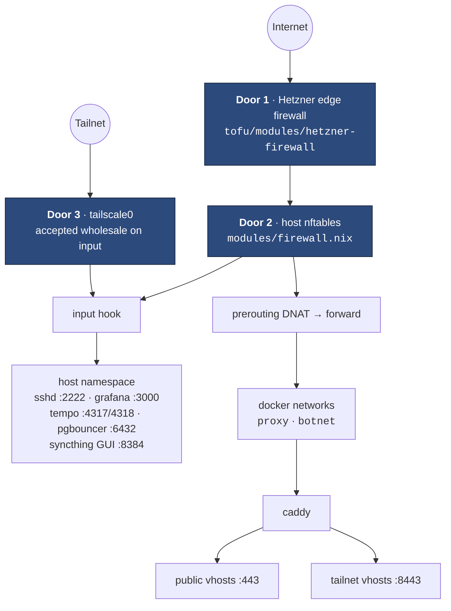
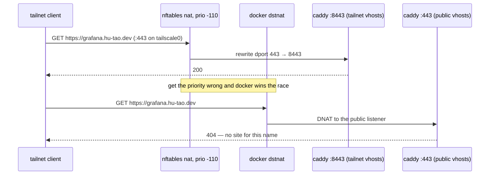

# Network and trust boundaries

Traffic reaches the VPS through three doors, and each service sits behind
exactly one of them.

## The two firewalls

The edge firewall (`tofu/`) and the host firewall (`modules/firewall.nix`) are
kept deliberately similar: **each is what survives a misconfiguration of the
other.** A port opened at one but not the other is still closed. When something
is unreachable, check both.

## input vs forward — the single most load-bearing fact

A published container port is **DNAT'd in prerouting and then forwarded** — it
never touches the input hook. Docker writes its own accepts into the
`ip filter` table; in nftables _every_ table's chain runs, and an accept in
docker's table cannot rescue a packet that `table inet nixos-fw` drops. So:

- A service's **published port belongs in the forward allow-list**, not input.
  Getting it backwards yields a port the internet can reach that the firewall
  never authorised.
- **Host-namespace services** (sshd on 2222, grafana, tempo, pgbouncer,
  syncthing) are on the **input** hook.
- `networking.nftables.flushRuleset` **must stay false**. The default flushes
  the entire ruleset — including the tables docker owns — on every reload, and
  docker only rebuilds them when `dockerd` starts. The symptom is latent:
  running containers keep working, the _next_ container start fails with
  `iptables: No chain/target/match by that name`, and recovery is
  `systemctl restart docker`.

This boundary is also why fail2ban jails for containerised services set
`chain_hook = forward`, which carries a sharp edge of its own — see
[Failure modes](../operations/recovery.md#the-fail2ban-blast-radius).

## Docker networks

| Network  | Subnet                   | Purpose                                                                                                                                                                                         |
| -------- | ------------------------ | ----------------------------------------------------------------------------------------------------------------------------------------------------------------------------------------------- |
| `proxy`  | docker's pool            | caddy resolves its upstreams here by container name over docker's embedded DNS — no IP addresses in the Caddyfile                                                                               |
| `botnet` | `172.30.0.0/24` (pinned) | the discord bot + its redis, isolated from the proxy. Pinned because `infra.botGateway` (172.30.0.1) is a literal in the bot's `DATABASE_URL`, its OTLP endpoint, and the firewall's input rule |

`modules/containers/default.nix` creates each network as a oneshot systemd unit
that every container on it `requires`, so a container can never start onto a
network that does not exist yet.

`infra.dockerBridgeGateway` (172.17.0.1) is a third address that matters: it is
how a container reaches a service in the **host's** network namespace, which is
what caddy does for grafana:3000 and syncthing's GUI:8384. It is **observed,
not enforced** — deliberately not pinned with the daemon's `bip` setting, even
though pinning is what `botSubnet`/`botGateway` do for a network this repo
creates itself. `bip` is daemon config, so setting it restarts `docker.service`,
which stops every container. A wrong value here costs one failed container
start and a rollback; pinning it costs a full container restart on every deploy
that touches the line.

## Tailscale

`--ssh` is on, so administrative access is Tailscale SSH. The tailnet interface
is accepted wholesale on the input hook, which is how the tailnet-only services
(grafana, tempo, dozzle, pgbouncer, syncthing GUI) are kept private — by the
_absence_ of an internet rule, not by their bind address. Several bind
`0.0.0.0` and rely entirely on this.

Three of them also answer by name — `dozzle.`, `grafana.` and `syncthing.` —
and that is the same mechanism wearing a hat. Caddy runs a **second listener**
on `infra.tailnetHttpsPort` (8443) carrying those three vhosts and nothing
else; like every other private port it is published on `0.0.0.0` and kept
private by being in neither allow-list. What makes the URL portless is a `nat`
chain at priority **-110**, ten ahead of docker's `dstnat`, rewriting port 443
arriving on `tailscale0` onto it.

Getting that priority wrong is silent: docker DNATs the packet to caddy's
_public_ listener first and the name 404s.

The names are plain A records to the box's `100.x` address
(`tofu/modules/cloudflare-dns`). A CNAME to the node's MagicDNS name would
avoid that literal — the trap `modules/containers/tempo.nix` documents — but
Tailscale does not publish `<node>.<tailnet>.ts.net` in public DNS (verified
2026-09-17: empty answers from 1.1.1.1, 9.9.9.9 and 8.8.8.8), so it resolves
only on a device whose MagicDNS is active and fails silently on one where it is
not. The literal is the lesser failure: it goes stale only when the machine is
replaced, and it goes stale loudly. The certificate covers the names as
ordinary SANs, because DNS-01 never asks whether a name resolves publicly.

## Why there is no private network

The two machines had a Hetzner private network. It was deleted on 2026-09-19,
and the reasoning is worth keeping because the shape recurs:

- It had **one member**. A private network with a single host is a subnet, not
  a topology.
- **hcloud firewalls do not filter private traffic.** Door 1 simply does not
  exist on that interface.
- The VPS input chain accepts nine ports **with no `iifname` qualifier**, so
  every one of them was reachable from the private interface as readily as from
  the internet.

Together that is a standing bypass of two of the three doors, waiting for a
second member to make it exploitable. The runner reaches the VPS over ordinary
public HTTPS instead, where all three doors apply and Caddy can read the
request. See [CI runner isolation](runner.md).
