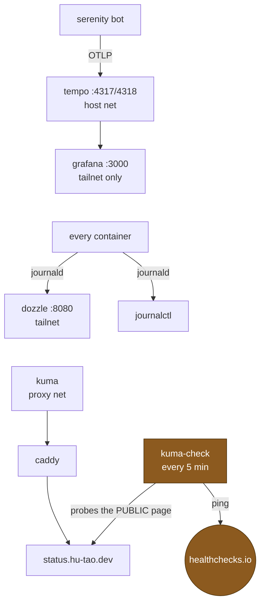

# Observability

tempo and grafana use host networking and are kept private by the input chain
([Network](network.md#input-vs-forward--the-single-most-load-bearing-fact)),
not by their bind address. kuma publishes no port and is reached only through
caddy.

## The self-hosted status page paradox

kuma cannot report its own host being down. That is closed by `kuma-check`, an
out-of-band timer that probes the **public** status page every five minutes and
pings healthchecks.io. Healthchecks alerts on the _absence_ of a ping, so
silence becomes the alert rather than an all-clear.

The principle is worth naming once: **a monitor that reports nothing when it
cannot run is not a monitor.**

## Where to look when something is wrong

| Symptom                    | First place                                                                                        |
| -------------------------- | -------------------------------------------------------------------------------------------------- |
| a site is down             | `dozzle` at :8080 directly — it is what you open when caddy is the broken part                     |
| a container will not start | `journalctl -u docker-<name>`                                                                      |
| a deploy failed            | the deploy output itself; then `journalctl -u <unit>` for the unit it named                        |
| mail is not delivered      | the issuer check in [TLS, DNS and mail](tls-dns-mail.md#the-cloudflare-tokens), then DMS's own log |
| a CI job never starts      | `journalctl -u gitea-runner-forgejo` **on the runner**, reached with `ssh -J vps`                  |
| traces are missing         | tempo is on host networking; check the input chain admits the bot's bridge                         |
