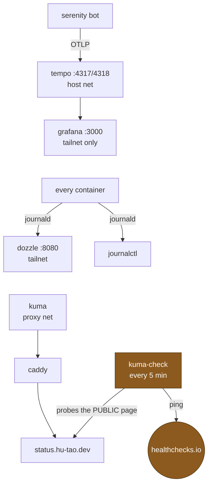

# Observability

```mermaid
flowchart TB
    bot["serenity bot"] -- OTLP --> tempo["tempo :4317/4318<br/>host net"]
    tempo --> graf["grafana :3000<br/>tailnet only"]

    graf ~~~ cont
    cont["every container"] -- journald --> doz["dozzle :8080<br/>tailnet"]
    cont -- journald --> jctl["journalctl"]

    doz ~~~ kuma
    kuma["kuma<br/>proxy net"] --> cad["caddy"] --> status["status.hu-tao.dev"]
    check["kuma-check<br/>every 5 min"] -- "probes the PUBLIC page" --> status
    check -- ping --> hc(("healthchecks.io"))

    classDef alert fill:#8c5a1f,stroke:#4d330d,color:#fff
    class check,hc alert
```

tempo and grafana use host networking and are kept private by the input chain
([Network](network.md#input-vs-forward--the-single-most-load-bearing-fact)),
not by their bind address. kuma publishes no port and is reached only through
caddy.

## The self-hosted status page paradox

kuma cannot report its own host being down. That is closed by `kuma-check`, an
out-of-band timer that probes the **public** status page every five minutes and
pings healthchecks.io. Healthchecks alerts on the _absence_ of a ping, so
silence becomes the alert rather than an all-clear.

The principle is worth naming once: **a monitor that reports nothing when it
cannot run is not a monitor.**

## The bot's dashboards

Four dashboards are seeded from `modules/containers/grafana-dashboards/` into a
**Provisioned** folder: overview, guild, user and DMs, linked so a guild or user
row drills into its own view with the time range carried across. Every panel is
TraceQL against tempo. Any other dashboard lives only in `grafana_data`, which
restic already covers.

UI edits save (`allowUiUpdates`), but the directory is one store path, so
**editing any file in it re-seeds all four** and discards UI edits across the
folder. Export a dashboard back into git before touching its neighbours.

Two query guards are bound to a date:

- a second target on `span.guild_id =~ "Some.*"` keeps spans from before
  2026-09-17, when `guild_id` was recorded in its Debug spelling;
- `span.attachment_urls != nil` on the span tables, because `attachments` and
  `links` changed from string to integer on 2026-09-18, and the tempo plugin
  **panics** (HTTP 500, "No data") on a column whose type changes mid-result.

Delete both once tempo's retention no longer reaches those dates.

## Where to look when something is wrong

| Symptom                    | First place                                                                                        |
| -------------------------- | -------------------------------------------------------------------------------------------------- |
| a site is down             | `dozzle` at :8080 directly — it is what you open when caddy is the broken part                     |
| a container will not start | `journalctl -u docker-<name>`                                                                      |
| a deploy failed            | the deploy output itself; then `journalctl -u <unit>` for the unit it named                        |
| mail is not delivered      | the issuer check in [TLS, DNS and mail](tls-dns-mail.md#the-cloudflare-tokens), then DMS's own log |
| a CI job never starts      | `journalctl -u forgejo-runner` **on the runner**, reached with `ssh -J hutao@vps:2222`             |
| traces are missing         | tempo is on host networking; check the input chain admits the bot's bridge                         |
