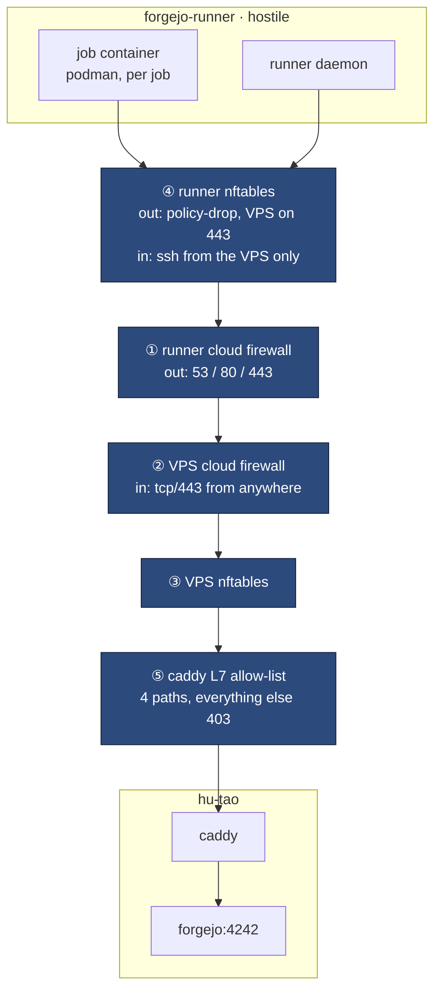
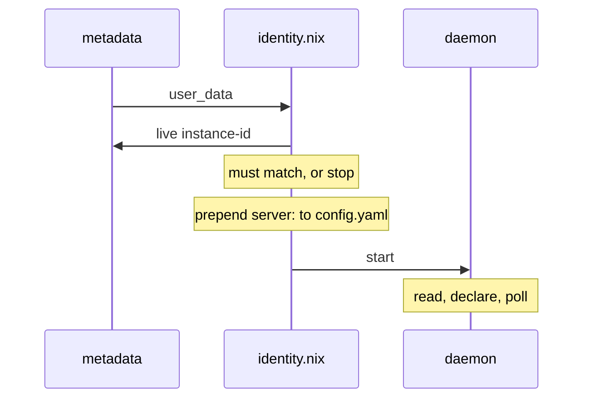

# CI runner isolation

The runner is the one machine here that **runs code this repo did not write**.
Every other design decision in this book protects a service from the internet;
this one protects the estate from its own CI.

## What it replaced

The runner used to be a container on the VPS with `/var/run/docker.sock`
bind-mounted in. That socket is root on the machine serving mail, git, every
sops secret and two Minecraft servers — so any workflow, including one opened
by a dependency bot, was one `docker run -v /:/host` away from the entire
estate.

The isolation boundary did not get stronger. **It moved** — from a container to
a VM — and what sits inside it got much smaller.

## Seven layers



| # | Control                                                                                                                 | Where                           |
| - | ----------------------------------------------------------------------------------------------------------------------- | ------------------------------- |
| 1 | Runner cloud firewall: in = tcp/22 from the VPS /32 only; out = 53/80/443                                               | `tofu/runner-firewall.tf`       |
| 2 | VPS cloud firewall: tcp/22 outbound to the runner /32                                                                   | `tofu/modules/hetzner-firewall` |
| 3 | VPS nftables: output chain is policy-drop, one rule per runner address                                                  | `modules/firewall.nix`          |
| 4 | Runner nftables: output policy-drop, the VPS reachable on 443 and nothing else; inbound ssh accepted from the VPS alone | `modules/runner/firewall.nix`   |
| 5 | Caddy: runner addresses restricted to four Actions paths, everything else 403                                           | `modules/containers/caddy.nix`  |
| 6 | Job: no engine socket by default; its container is created per job and destroyed after                                  | `modules/runner/default.nix`    |
| 7 | `pages-pull`: a fetched artifact reduced to files and directories, modes normalised, before caddy serves it             | `modules/pages-pull.nix`        |

Every connection between the two hosts is either initiated **by the VPS**, or
is HTTPS from the runner to `git.hu-tao.dev` like any other client on the
internet. There is no private link, deliberately —
[see why](network.md#why-there-is-no-private-network).

Layer 7 is a different kind of control from the six above it, which is why it
was missing for a while. Every one of those reads an **address, a port or a
path**; none of them can read what is _inside_ a request that the allow-list
legitimately permits. The published artifact is exactly that — content the
runner authors, travelling through a route layer 5 has to admit, landing in a
tree caddy serves. [What it strips, and
why](../operations/pages.md#the-artifact-is-untrusted-content).

## Who may ssh in

Layers 1 and 4 both narrow inbound ssh to the VPS's `/32`, and that duplication
is the point — it is the same "each survives the other's misconfiguration"
arrangement as the two firewalls on the VPS. The host rule is:

```text
ip saddr <vps4> tcp dport 22 ct state new counter name ssh_from_vps accept
tcp dport 22 ct state new counter name ssh_blocked log prefix "DROP_ssh: " drop
```

It used to be a bare `tcp dport 22 ct state new accept`, on the reasoning that
only the cloud firewall should key on the VPS's address, since a host rule would
have to survive that address changing. The rest of the file had already taken
that bet: the output and forward chains key their one-way drops on the same
address, there is an assertion that it is non-empty, and the VM test exists
precisely to override it.

**What settles it is that the two failure modes are not symmetric.** A stale
address in the _egress_ rules fails **open** — the drop matches nothing, the
runner reaches the new address on every port, and the one-way design is gone
with no error anywhere. Stale here fails **closed**: nobody can ssh in,
Hetzner's web console still works, and the fix is one rebuild. Closed is the
direction to be wrong in.

IPv4 only, matching the cloud rule, which lists a v4 `/32` and no v6 source at
all — so v6 ssh was never reachable through the layer above. The second line is
redundant with the chain's drop policy and exists to be _named_: the catch-all
carries an anonymous counter, so without it a refused ssh is indistinguishable
from any other dropped packet.

Verified live after the deploy, from the VPS:

```console
$ ssh -J vps root@46.225.61.172 nft list counter inet nixos-fw ssh_from_vps
counter ssh_from_vps {
    packets 2 bytes 120
}
```

## The one-way rule, and how it is enforced

The runner's nftables `output` chain is policy-drop, and the three lines that
matter are ordered above every broad accept:

```text
ip  daddr <vps4> tcp dport 443 ct state new counter name vps_allowed_out accept
ip  daddr <vps4>                counter name vps_blocked_out  log prefix "DROP_vps_out: "  drop
ip6 daddr <vps6>                counter name vps_blocked_out6 log prefix "DROP_vps_out6: " drop
```

**Order is the whole control.** nftables is first-match-wins within a chain,
and the chain below these carries `oifname "podman*" accept` and
`tcp dport { 53, 80, 443 } accept`. Move the drop under either one and a
generic `tcp dport 443` matches first, so the drop never runs — and nothing
visibly breaks, because the traffic it was supposed to stop is traffic that
also works. The same three lines are repeated in the `forward` chain, because
job containers route through it rather than through `output`.

The v6 line drops the VPS's whole `/64` outright: nothing legitimate goes there
over v6, and a runner that can reach the box on any v6 address has defeated the
v4 rules.

### The metadata service is the host's alone

The `forward` chain carries one drop the `output` chain deliberately does not:

```nft
iifname "podman*" ip daddr 169.254.0.0/16 counter name metadata_blocked_fwd drop
```

`169.254.169.254` answers this server's own `user_data`, and `tofu/server.tf`
puts the box's **Forgejo registration pair** there — the per-runner entry from
`var.runner_identities`.
`modules/runner/identity.nix` reads it once at boot from the host's netns,
which is why the output chain allows `tcp/80` and this drop leaves that path
alone.

A job container is a different netns, so its packets are _forwarded_ and land
here instead. Without the rule they reach the same endpoint, and one `curl` in
a workflow returns the uuid and secret — enough to register a second runner
daemon against the instance, call `FetchTask`, and receive other jobs along
with their tokens. That is precisely the persistence `container.docker_host:
"-"` was chosen to deny, arriving by a route that never touches a container
socket.

It matches the whole `169.254.0.0/16` rather than the single address: nothing a
job does has business in link-local space, and a provider that moves its
endpoint within that block does not get to reopen this quietly.

**Not live on the current box.** It predates the mechanism and tofu holds
`user_data` in `ignore_changes`, so the endpoint returns `204` today and the
identity instead sits in a `0700` root-owned file a job cannot reach. The rule
is there for the next runner tofu **creates**, which
`tofu/variables.tf` documents as the ordinary
way to add one.

Two things test this:

- `tests/runner-firewall.nix` — a three-node NixOS VM test with real packets,
  six subtests. The third node exists only to be **not** the VPS: without it
  the ingress half could show that ssh from the VPS is accepted, which was
  never the half in doubt. It asserts on the counters rather than on `nc`'s
  exit status, because no sshd is listening on the test node and a permitted
  connection is refused exactly like a filtered one is. It needs `/dev/kvm` and
  the VPS does not have it (shared-vCPU Hetzner instance, no nested
  virtualisation), so it is **hand-run** on a machine with KVM:
  `nix build .#checks.x86_64-linux.runner-firewall -L`.
- `runner-firewall-ordering` — greps the _evaluated_ ruleset for line order.
  No KVM, costs seconds, runs in CI. It catches the exact regression the VM
  test exists for — the VPS rules sinking below a broad `podman*` accept — just
  not with a real packet.

Measured, not assumed: 443 to the VPS returns 200; 22 and 2222 are dropped,
with the drop counter moving 0 → 14.

## Why layer 5 exists

Layers 1–4 are address-and-port controls. They can say "that box may reach
tcp/443 here" and nothing finer — and the runner **must** reach 443, because
that is how it fetches jobs. Without something reading the request, a rooted
job gets the whole Forgejo surface: every repo it can see, the web UI, all of
`/api/v1`.

Caddy narrows that to four paths:

```text
/api/actions/*
/twirp/github.actions.results.api.v1.ArtifactService/*
/*/*/info/refs
/*/*/git-upload-pack
```

That set was **measured** from a real run's access log, not guessed. No
`/api/v1`, no web UI, and — the one worth saying out loud — no
`git-receive-pack`: **the runner can clone and cannot push.** That converts the
open-ended risk "a compromised runner can push to repos it built" into
something a packet filter could never express, because push and fetch share a
port and a TLS session.

`/api/actions_pipeline/*` was in this list and was deliberately removed. It is
the v3 artifact API, added defensively on a guess that uploads rode it; a full
run's capture never touched it. An allow-list entry nothing uses is surface,
and this is the layer whose whole job is to have less of it.

`remote_ip` is the TCP peer and never a header: `trusted_proxies` is unset and
every DNS record is `proxied = false`, so there is nothing in front of Caddy to
launder an address. **A rooted runner can forge any token it holds; it cannot
forge its source address.**

Verified from the runner: 403 on `/`, `/api/v1/version`, `/explore/repos` and
`/user/login`; allowed paths proxy through; ordinary clients still 200
everywhere; a full workflow run produced no 403 at all.

## The job's engine socket

`container.docker_host` is podman's socket — exactly the access the old
in-container runner's `docker_host: "-"` and one-entry `valid_volumes`
allow-list existed to **deny**.

That is not a relaxation of the old position. It is the same position at a
different blast radius: a workflow that escapes here gets root on a machine
holding a nix store, a job cache and its own runner token — no mail, no git, no
sops key — and the box is a snapshot away from replacement.

Podman rather than docker, and not as a preference: docker's nftables
integration is what produced the half-working published ports and forward-chain
traps documented at length in `modules/firewall.nix`. Jobs still get a working
`docker` command (`dockerCompat` plus `dockerSocket`), so a workflow that
shells out to docker needs no edit.

`forgejo-runner` 13.1.0's `daemon` has **no `--ephemeral`/`--once` flag**, so
one-job-per-runner-lifetime is not available upstream. Per-job disposability
comes from the container being created and destroyed per job instead.

## The job image, and the second label

Every JavaScript action — `actions/checkout` included — is executed by a `node`
binary **inside the job container**, not by the runner. The `nix` label is
`nixos/nix`, which carries nix, bash, gitMinimal, curl and coreutils and no
node, so on that label `uses:` cannot run at all and every workflow hand-writes
its checkout as a `git fetch`.

That is a correctness trap and not only an inconvenience. A hand-written fetch
is anonymous unless the author remembers to thread the job token through it —
and on a **public** repo an anonymous fetch works. The omission is therefore
invisible on five of the six repos on this instance and fatal on the sixth:
`cv-template`, the one private repo, failed with `could not read Username for
'https://git.hu-tao.dev'`. `actions/checkout` defaults its `token` input to the
injected job token, so on an image with node the private-repo case needs no
thought from the workflow author.

So there is a second label, and it is **additive**:

| Label           | Image                           | node | Notes                                                                          |
| --------------- | ------------------------------- | ---- | ------------------------------------------------------------------------------ |
| `nix`           | `nixos/nix:2.35.2`              | no   | what this repo's own workflows run on                                          |
| `nix-node`      | `localhost/forgejo-ci-nix-node` | yes  | nix **and** node; built here, not pulled                                       |
| `ubuntu-latest` | `node:22-bookworm`              | yes  | no nix, and no `sudo` — see [CI](../operations/ci.md#why-the-two-files-differ) |
| `node-22`       | `node:22-bookworm`              | yes  |                                                                                |
| `alpine`        | `alpine:3.22`                   | no   |                                                                                |

`nix` is untouched, so `vps`, `skavex`, `compress` and `serenity-discord-bot`
keep building on exactly the image they build on today; a repo opts in by
changing `runs-on`. A broken image here cannot take CI down for four working
repos.

### Why it is not in a registry

`force_pull` is `false`, so the runner uses a locally present image without
reaching for a registry. That lets the image be an ordinary Nix derivation
(`modules/runner/ci-image.nix`) loaded into podman at activation — pinned by
`flake.lock`, rebuilt only when its inputs change, with no push credential, no
pull secret and no package visibility to get wrong. The label's reference comes
from `config.runner.ciImageRef` rather than a repeated string literal, so the
label and the image it names cannot drift apart.

`buildLayeredImageWithNixDb`, not `buildLayeredImage`. The plain builder copies
the store paths in but leaves `/nix/var/nix/db` empty, and a nix that cannot
read its own database treats every path in the image as absent — `nix develop`
then rebuilds a closure that is already sitting on the disk.

The image provides `/usr/bin/env` and nothing else from the FHS. dockerTools
links `contents` into `/bin` and creates no `/usr` at all, while `nixos/nix`
ships the usual `env` — so a workflow that worked on the `nix` label dies here
on the most common shebang in the ecosystem, `#!/usr/bin/env node`. Every binary
npm and pnpm install starts that way, which is why `pnpm check` on `skavex`
failed at its first step with a message naming the interpreter rather than the
script.

### The garbage collector eats it

`podman system prune -f --all` runs daily, and `--all` removes every image no
container references. Between jobs nothing references this one, so it is deleted
like any other cold image — and every job on `nix-node` then dies in about three
seconds on a pull of a `localhost/` reference no registry can serve. Observed
2026-09-21 across `cv-template`, `skavex` and `nixos-dotfiles` at once, on
workflows that were green hours earlier and had not changed.

Two things were wrong, and the second is the one worth carrying forward:

- **Nothing put the image back.** `podman-prune` now carries an `ExecStartPost`
  that restarts the load unit. `ExecStartPost` rather than `OnSuccess=`, because
  `OnSuccess` only _starts_ a unit — which is the same trap one layer up.
- **The load unit had `RemainAfterExit`.** systemd therefore believed it active
  forever after its first success and would not run it again; and because the
  unit's own text does not change when the image does, a deploy could not
  restart it either. So the deploy that installed the prune hook fixed the
  _next_ deletion and left the current one in place, and every job kept failing
  until the unit was restarted by hand. Dropping the flag is what makes both
  healing paths work, since activation starts wanted-but-inactive units. It only
  ever bought skipping a `podman load` whose layers were already on disk.

## Identity, and why it is not a Nix string

The runner is a **declared** runner: a uuid+secret pair Forgejo issues for one
record, written into `server.connections` in `config.yaml`. No imperative
`forgejo-runner register` call (deprecated upstream), no `.runner` state file.

But this box is a snapshot cloned into N runners, so the uuid cannot be a Nix
string the way it was for the VPS's single permanent runner — every clone would
claim the same runner record, which is undefined.



Identity arrives via Hetzner user-data and is **checked against the live
`instance-id` before the pair is read**, so a cloned snapshot is inert
elsewhere. The static half of `config.yaml` (capacity, cache, engine settings)
is a Nix-checked `writeText`; only the genuinely per-instance part is
imperative.

## Cache

The Actions cache is served by the runner itself on `infra.cacheProxyPort`
(34567), reached from job containers over the per-job podman bridge and
admitted by one input rule. The port is **fixed rather than random** because a
firewall rule cannot name a port the daemon chooses at startup.

A new box starts empty, so the first run after provisioning pays full compile.
`serenity-discord-bot`, same commit, back to back:

| job                                                               | cold  | warm      |      |
| ----------------------------------------------------------------- | ----- | --------- | ---- |
| `test` (postgres + redis services)                                | 13m2s | **4m20s** | 3.0× |
| `build (--all-features)`                                          | 6m43s | **1m32s** | 4.4× |
| `build (--features "opentelemetry ai-openrouter util-download")`  | 6m34s | **1m32s** | 4.3× |
| `build ()`                                                        | 4m48s | **1m19s** | 3.6× |
| `clippy (--all-features)`                                         | 5m30s | **1m15s** | 4.4× |
| `clippy (--features "opentelemetry ai-openrouter util-download")` | 4m49s | **1m14s** | 3.9× |
| `clippy ()`                                                       | 4m34s | **1m7s**  | 4.1× |
| `fmt` — no cache, control                                         | 48s   | 40s       | —    |

`fmt` is the control: it uses no cache and did not move, which rules out "the
new box is just slower" as an explanation for the cold column.

### Why the cache works when artifacts did not

Both run the same hostname test. `@actions/*` checks `GITHUB_SERVER_URL`
against `GITHUB.COM`, `*.GHE.COM`, `*.LOCALHOST`, else "GHES" — and on a
Forgejo instance that always says GHES. **What each package does with the
answer is opposite:**

- `@actions/artifact` v2+ **throws `GHESNotSupportedError` before opening a
  socket.** `actions/upload-artifact@v4` therefore fails with zero HTTP
  requests — invisible in server access logs, and not fixable at any layer
  below the action. Use `forgejo/upload-artifact` (and `download-artifact`),
  whose single patch is to make that check return false.
- `@actions/cache`, including via `Swatinem/rust-cache@v2`, uses it to **select
  the v1 API**: `if (isGhes()) return 'v1'`. v1 is `ACTIONS_CACHE_URL` +
  `_apis/artifactcache/`, which forgejo-runner's cache proxy implements.

Same check, opposite outcome. `No cache found.` is the successful-but-empty
branch; an unreachable cache server goes to `catch`/`reportError` instead, so
that message alone never means broken plumbing.

## Host ephemerality, and why it is not on

Wiping the runner on every boot was considered and **rejected**:

- It conflicts with the cache. `rust-cache` restores arbitrary files into
  `~/.cargo` and `target/`, so a cache preserved across the wipe carries
  poisoning through it — and a cache not preserved costs the cold column above
  on every single run.
- forgejo-runner already implements GitHub-style **PR-scoped cache write
  isolation**: writes from a pull request go to `refs/pull/N`, reads fall back
  to the shared scope. A PR cannot poison the cache the base branch reads.

So the honest statement is that the host is durable and the job is disposable,
and the thing that makes that acceptable is how little the host holds.
