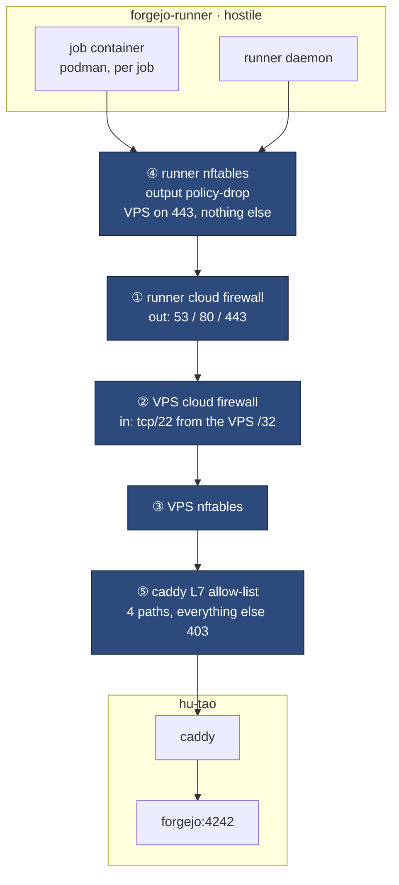
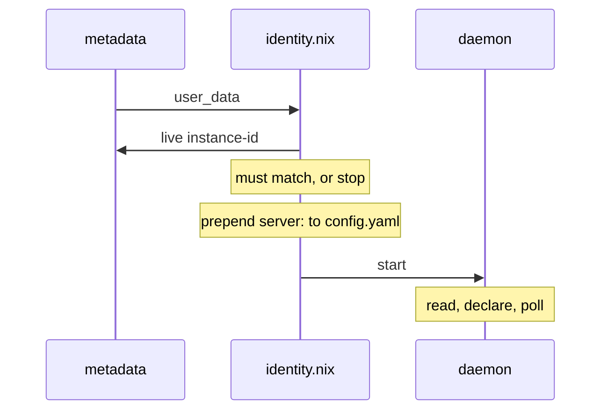

# CI runner isolation

The runner is the one machine here that **runs code this repo did not write**.
Every other design decision in this book protects a service from the internet;
this one protects the estate from its own CI.

## What it replaced

The runner used to be a container on the VPS with `/var/run/docker.sock`
bind-mounted in. That socket is root on the machine serving mail, git, every
sops secret and two Minecraft servers — so any workflow, including one opened
by a dependency bot, was one `docker run -v /:/host` away from the entire
estate.

The isolation boundary did not get stronger. **It moved** — from a container to
a VM — and what sits inside it got much smaller.

## Six layers



| #   | Control                                                                                | Where                           |
| --- | -------------------------------------------------------------------------------------- | ------------------------------- |
| 1   | Runner cloud firewall: in = tcp/22 from the VPS /32 only; out = 53/80/443              | `tofu/runner-firewall.tf`       |
| 2   | VPS cloud firewall: tcp/22 outbound to the runner /32                                  | `tofu/modules/hetzner-firewall` |
| 3   | VPS nftables: output chain is policy-drop, one rule per runner address                 | `modules/firewall.nix`          |
| 4   | Runner nftables: output policy-drop; the VPS reachable on 443 and nothing else         | `modules/runner/firewall.nix`   |
| 5   | Caddy: runner addresses restricted to four Actions paths, everything else 403          | `modules/containers/caddy.nix`  |
| 6   | Job: no engine socket by default; its container is created per job and destroyed after | `modules/runner/default.nix`    |

Every connection between the two hosts is either initiated **by the VPS**, or
is HTTPS from the runner to `git.hu-tao.dev` like any other client on the
internet. There is no private link, deliberately —
[see why](network.md#why-there-is-no-private-network).

## The one-way rule, and how it is enforced

The runner's nftables `output` chain is policy-drop, and the three lines that
matter are ordered above every broad accept:

```text
ip  daddr <vps4> tcp dport 443 ct state new counter name vps_allowed_out accept
ip  daddr <vps4>                counter name vps_blocked_out  log prefix "DROP_vps_out: "  drop
ip6 daddr <vps6>                counter name vps_blocked_out6 log prefix "DROP_vps_out6: " drop
```

**Order is the whole control.** nftables is first-match-wins within a chain,
and the chain below these carries `oifname "podman*" accept` and
`tcp dport { 53, 80, 443 } accept`. Move the drop under either one and a
generic `tcp dport 443` matches first, so the drop never runs — and nothing
visibly breaks, because the traffic it was supposed to stop is traffic that
also works. The same three lines are repeated in the `forward` chain, because
job containers route through it rather than through `output`.

The v6 line drops the VPS's whole `/64` outright: nothing legitimate goes there
over v6, and a runner that can reach the box on any v6 address has defeated the
v4 rules.

Two things test this:

- `tests/runner-firewall.nix` — a two-node NixOS VM test with real packets.
  It needs `/dev/kvm` and the VPS does not have it (shared-vCPU Hetzner
  instance, no nested virtualisation), so it is **hand-run** on a machine with
  KVM: `nix build .#checks.x86_64-linux.runner-firewall -L`.
- `runner-firewall-ordering` — greps the _evaluated_ ruleset for line order.
  No KVM, costs seconds, runs in CI. It catches the exact regression the VM
  test exists for — the VPS rules sinking below a broad `podman*` accept — just
  not with a real packet.

Measured, not assumed: 443 to the VPS returns 200; 22 and 2222 are dropped,
with the drop counter moving 0 → 14.

## Why layer 5 exists

Layers 1–4 are address-and-port controls. They can say "that box may reach
tcp/443 here" and nothing finer — and the runner **must** reach 443, because
that is how it fetches jobs. Without something reading the request, a rooted
job gets the whole Forgejo surface: every repo it can see, the web UI, all of
`/api/v1`.

Caddy narrows that to four paths:

```text
/api/actions/*
/twirp/github.actions.results.api.v1.ArtifactService/*
/*/*/info/refs
/*/*/git-upload-pack
```

That set was **measured** from a real run's access log, not guessed. No
`/api/v1`, no web UI, and — the one worth saying out loud — no
`git-receive-pack`: **the runner can clone and cannot push.** That converts the
open-ended risk "a compromised runner can push to repos it built" into
something a packet filter could never express, because push and fetch share a
port and a TLS session.

`/api/actions_pipeline/*` was in this list and was deliberately removed. It is
the v3 artifact API, added defensively on a guess that uploads rode it; a full
run's capture never touched it. An allow-list entry nothing uses is surface,
and this is the layer whose whole job is to have less of it.

`remote_ip` is the TCP peer and never a header: `trusted_proxies` is unset and
every DNS record is `proxied = false`, so there is nothing in front of Caddy to
launder an address. **A rooted runner can forge any token it holds; it cannot
forge its source address.**

Verified from the runner: 403 on `/`, `/api/v1/version`, `/explore/repos` and
`/user/login`; allowed paths proxy through; ordinary clients still 200
everywhere; a full workflow run produced no 403 at all.

## The job's engine socket

`container.docker_host` is podman's socket — exactly the access the old
in-container runner's `docker_host: "-"` and one-entry `valid_volumes`
allow-list existed to **deny**.

That is not a relaxation of the old position. It is the same position at a
different blast radius: a workflow that escapes here gets root on a machine
holding a nix store, a job cache and its own runner token — no mail, no git, no
sops key — and the box is a snapshot away from replacement.

Podman rather than docker, and not as a preference: docker's nftables
integration is what produced the half-working published ports and forward-chain
traps documented at length in `modules/firewall.nix`. Jobs still get a working
`docker` command (`dockerCompat` plus `dockerSocket`), so a workflow that
shells out to docker needs no edit.

`forgejo-runner` 13.1.0's `daemon` has **no `--ephemeral`/`--once` flag**, so
one-job-per-runner-lifetime is not available upstream. Per-job disposability
comes from the container being created and destroyed per job instead.

## Identity, and why it is not a Nix string

The runner is a **declared** runner: a uuid+secret pair Forgejo issues for one
record, written into `server.connections` in `config.yaml`. No imperative
`forgejo-runner register` call (deprecated upstream), no `.runner` state file.

But this box is a snapshot cloned into N runners, so the uuid cannot be a Nix
string the way it was for the VPS's single permanent runner — every clone would
claim the same runner record, which is undefined.



Identity arrives via Hetzner user-data and is **checked against the live
`instance-id` before the pair is read**, so a cloned snapshot is inert
elsewhere. The static half of `config.yaml` (capacity, cache, engine settings)
is a Nix-checked `writeText`; only the genuinely per-instance part is
imperative.

## Cache

The Actions cache is served by the runner itself on `infra.cacheProxyPort`
(34567), reached from job containers over the per-job podman bridge and
admitted by one input rule. The port is **fixed rather than random** because a
firewall rule cannot name a port the daemon chooses at startup.

A new box starts empty, so the first run after provisioning pays full compile.
`serenity-discord-bot`, same commit, back to back:

| job                                                               | cold  | warm      |      |
| ----------------------------------------------------------------- | ----- | --------- | ---- |
| `test` (postgres + redis services)                                | 13m2s | **4m20s** | 3.0× |
| `build (--all-features)`                                          | 6m43s | **1m32s** | 4.4× |
| `build (--features "opentelemetry ai-openrouter util-download")`  | 6m34s | **1m32s** | 4.3× |
| `build ()`                                                        | 4m48s | **1m19s** | 3.6× |
| `clippy (--all-features)`                                         | 5m30s | **1m15s** | 4.4× |
| `clippy (--features "opentelemetry ai-openrouter util-download")` | 4m49s | **1m14s** | 3.9× |
| `clippy ()`                                                       | 4m34s | **1m7s**  | 4.1× |
| `fmt` — no cache, control                                         | 48s   | 40s       | —    |

`fmt` is the control: it uses no cache and did not move, which rules out "the
new box is just slower" as an explanation for the cold column.

### Why the cache works when artifacts did not

Both run the same hostname test. `@actions/*` checks `GITHUB_SERVER_URL`
against `GITHUB.COM`, `*.GHE.COM`, `*.LOCALHOST`, else "GHES" — and on a
Forgejo instance that always says GHES. **What each package does with the
answer is opposite:**

- `@actions/artifact` v2+ **throws `GHESNotSupportedError` before opening a
  socket.** `actions/upload-artifact@v4` therefore fails with zero HTTP
  requests — invisible in server access logs, and not fixable at any layer
  below the action. Use `forgejo/upload-artifact` (and `download-artifact`),
  whose single patch is to make that check return false.
- `@actions/cache`, including via `Swatinem/rust-cache@v2`, uses it to **select
  the v1 API**: `if (isGhes()) return 'v1'`. v1 is `ACTIONS_CACHE_URL` +
  `_apis/artifactcache/`, which forgejo-runner's cache proxy implements.

Same check, opposite outcome. `No cache found.` is the successful-but-empty
branch; an unreachable cache server goes to `catch`/`reportError` instead, so
that message alone never means broken plumbing.

## Host ephemerality, and why it is not on

Wiping the runner on every boot was considered and **rejected**:

- It conflicts with the cache. `rust-cache` restores arbitrary files into
  `~/.cargo` and `target/`, so a cache preserved across the wipe carries
  poisoning through it — and a cache not preserved costs the cold column above
  on every single run.
- forgejo-runner already implements GitHub-style **PR-scoped cache write
  isolation**: writes from a pull request go to `refs/pull/N`, reads fall back
  to the shared scope. A PR cannot poison the cache the base branch reads.

So the honest statement is that the host is durable and the job is disposable,
and the thing that makes that acceptable is how little the host holds.
