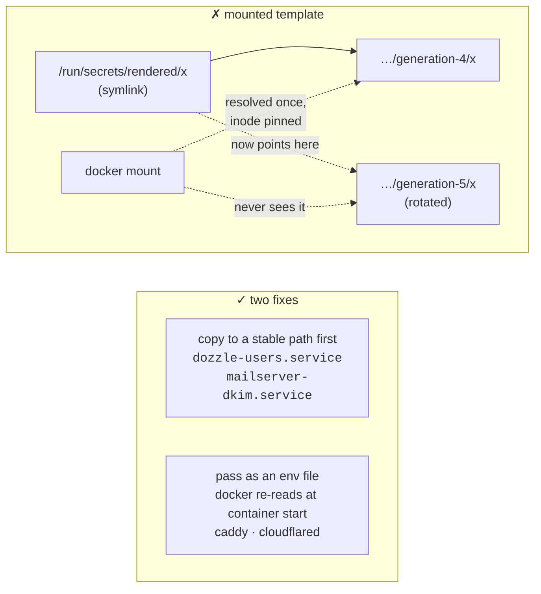

# Secrets

sops + age (`secrets.nix`). The age private key lives at
`/var/lib/sops-nix/key.txt` on the host and is staged there **before first
boot** by `nix run .#install` — without it, activation cannot decrypt anything
and the machine boots with no credentials, its own login included.

Two kinds of consumer:

- **`sops.secrets.*`** — a decrypted file at `/run/secrets/…`, for things read
  as a file: the restic password, the DKIM key, the database password.
- **`sops.templates.*`** — a rendered file mixing secrets with literal text,
  for things that want `KEY=value`: the acme, grafana, caddy, cloudflared and
  searxng env files — and the tailnet auth key, which is the interesting one.

**Every key in `secrets.nix` must exist in `secrets.yaml`**, or
`sops-install-secrets` fails during activation. This is validated at _build_
time, so a missing key fails `nix build` rather than only the deploy — which is
why a new secret is added to `secrets.yaml` before the module that reads it.

`acme_email` is deliberately _not_ a secret: `security.acme` needs it at
evaluation time, and a registration contact address is not a credential. It is
`infra.acmeEmail`.

## The tailnet key is assembled, not stored

`tailscale_oauth_client_secret` is an **OAuth client secret**, not a
`tskey-auth-` key. Tailscale accepts one in place of an auth key and it does
not expire, where the auth keys it replaces capped out at 90 days — leaving the
box one forgotten rotation away from being unable to rejoin its own tailnet
after a rebuild.

sops holds that string and nothing else. The two query parameters that go with
it live in `modules/services.nix`, in the clear, on purpose:

```nix
sops.templates."tailscale-authkey".content =
  "${config.sops.placeholder.tailscale_oauth_client_secret}?ephemeral=false&preauthorized=true";
```

`ephemeral=false` is mandatory and load-bearing. **An OAuth-minted key defaults
to `ephemeral=true`, and an ephemeral node is removed from the tailnet when it
goes offline** — so at the default this VPS would delete itself on every reboot
and rejoin as a new node with a new address, silently invalidating three DNS
records and the policy file's `vps` host. Inside ciphertext that is a
one-character mistake nobody can review; in a template it is a line in a diff.
See [The tailnet policy](tailnet.md#the-vps-joins-tagged-not-tagged-afterwards).

## The stale-symlink trap

A rendered template's real path is under a generation directory, and `.path`
only symlinks to it. **Docker resolves a symlink at mount time and holds that
inode forever**, so a rotated secret never reaches a container that _mounts_
the template.



Both fixes work because they re-resolve the symlink at container start rather
than pinning it at mount. The env-file form is the lighter of the two and is
why `searxng`'s bcrypt hash reaches caddy that way — see
[Access control](access-control.md).

## The runner has no secrets at all

`mkRunner` does not pass `sops-nix.nixosModules.sops`. The runner holds no age
key and can decrypt nothing in `secrets.yaml`; the only credential on the box
is its own runner token, delivered through Hetzner user-data and useless
elsewhere because it is checked against the live `instance-id` first.

This is asserted, not merely intended: `checks.runner-has-no-secrets` is a
`nix build`, because a check that is only evaluated never runs its builder.

## Never decrypt to inspect

Reading `secrets.yaml` to "check" something is how secrets end up in a
terminal, a log, or a pull request. The manifest in `secrets.nix` is the list
of what exists; the live box is the place to verify that a secret arrived
(`systemctl status`, the consuming service's own health), not the ciphertext.
