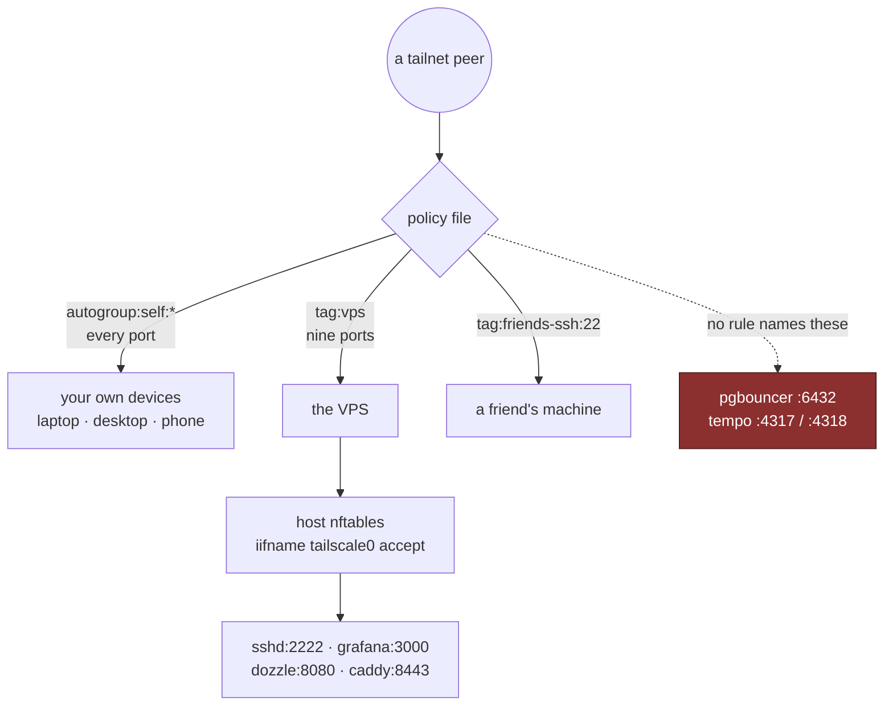

# The tailnet policy

The tailnet was, until 2026-09-20, the one piece of infrastructure this repo
did not describe. `modules/firewall.nix` accepts `iifname tailscale0`
wholesale — that is how every tailnet-only service is kept private, by the
_absence_ of an internet rule rather than by a bind address — so what a tailnet
peer could reach was decided entirely in a web console, by a document nothing
here could review, diff or roll back.

The consequence was a flat trust zone. Anything on the tailnet reached sshd on
2222, pgbouncer on 6432, tempo's two OTLP receivers, grafana, dozzle and
syncthing's GUI. One compromised phone was the whole estate. **nftables cannot
tell tailnet peers apart**; the policy file is the only layer that can, and it
is now `tofu/tailscale-policy.hujson`.

## One document, no partial ownership

The obvious wish is for tofu to own some rules and leave the rest to the
console. The provider forecloses it: `tailscale_acl` "controls a tailnet's
entire policy file and not just the ACLs section within it", and it "will
completely overwrite existing policy file contents". There is no section-level
ownership, and no `ignore_changes` that could give it — the whole document is
one string attribute.

**So anything omitted from that file is deleted on apply, and the plan does not
say so.** The first real plan here carried a `nodeAttrs` block granting four
devices Mullvad exit-node access plus tailnet Funnel, and a second tagOwner
with its ssh rule — none of it in the first draft, all of it silently on its
way out. It is carried over verbatim now, with a comment saying why each line
cannot be tidied. Before any apply that replaces this resource, read the live
policy in the admin console and diff it by eye.

HuJSON comments survive the apply and show up in the console, so the file is
also the documentation the next person reads _there_.

## Tags are the only way to narrow anything

This is the part that decides the shape of the whole file: **Tailscale has no
deny rules.** Rules are purely additive. You cannot narrow a destination by
adding a rule — you can only stop a wider rule from covering it.

The wider rule is the stock one, device-to-device over `autogroup:self`. And
per Tailscale's own documentation, "autogroup:self only applies to user-owned
devices. It does not apply to tagged devices." So the moment the VPS carries a
tag it drops out of that rule, and what is left is the explicit port list.



Tagging is deliberately **not** in the file. Applying a tag to a device is a
console action, or `tailscale up --advertise-tags`. So moving a machine between
trust classes needs no apply, no commit and no credential — which is the part
that genuinely wanted to be ad-hoc — while the rules themselves change rarely
and go through review.

## What is live

```text
acls: 1git2clone@github -> autogroup:self:*
      1git2clone@github -> tag:vps:22,53,80,443,2222,3000,8080,8384,8443,8880
      1git2clone@github -> tag:friends-ssh:22
ssh:  check  -> autogroup:self   as nonroot, root
      accept -> tag:friends-ssh  as nonroot, root
```

Every `src` is the owner account rather than `autogroup:member`, and that is a
smaller change than it looks. `autogroup:self` as a _destination_ means
"devices belonging to whoever opened this connection", evaluated per
connection — so member A could never reach member B's laptop through it. What
naming the account removes is the one remaining case, a second member reaching
_their_ own devices. On a tailnet with one real user that is a no-op today and
a closed door the day it stops being one.

The port list on `tag:vps` is everything a tailnet client legitimately reaches:

| Port        | What                                                                                                                                                             |
| ----------- | ---------------------------------------------------------------------------------------------------------------------------------------------------------------- |
| **2222**    | the host's own sshd — **deploy-critical**, `deploy .#vps` connects here. Drop it and deploys stop                                                                |
| 22          | forgejo's ssh, for git over the tailnet                                                                                                                          |
| 53          | the split-DNS resolver: answers `git.` and `status.` with this box's tailnet address, see [below](#split-dns-for-the-half-public-names)                          |
| 80 / 443    | redirected to 8880 / 8443 by the firewall's prerouting. **The ACL sees the port the client sent**, before the rewrite, so these are the ones that must be listed |
| 3000        | grafana, host networking                                                                                                                                         |
| 8080        | dozzle direct — the path that still works when caddy is the broken part                                                                                          |
| 8384        | syncthing's GUI                                                                                                                                                  |
| 8443 / 8880 | caddy's tailnet listeners, reachable directly as well as through the redirect                                                                                    |

**Deliberately absent: 6432 and 4317/4318.** pgbouncer and tempo's OTLP
receivers bind `0.0.0.0` and are reached by the discord bot over the docker
bridge, not from the tailnet — the input chain has a separate rule for that,
scoped to `botSubnet`. Nothing on the tailnet has ever needed them. A tailnet
peer reaching postgres is the shape of the incident this file exists to make
impossible.

## `tag:friends-ssh` is a destination and never a source

The tag predates this file. A friend's machine carries it for exactly one
reason: so it can be SSHed _into_ without the rest of the tailnet's members
reaching it. Tagging it took it out of its owner's `autogroup:self` — the same
lever `tag:vps` uses.

**One tag for the class, not one per machine.** A second friend's laptop joins
this tag rather than arriving with a tagOwner, three rules and two tests of its
own that a reviewer would have to read in full to discover they grant exactly
what this one already grants.

Assigning it is a console action, and the order matters the same way it does
for `tag:vps`: a device cannot be given `tag:friends-ssh` until an applied
policy defines it, so `tofu apply` comes first and
**Machines → the device → Edit ACL tags** second. A device whose tag no rule
here names has no grant at all — `autogroup:self` does not cover it either,
because it is tagged.

Nothing on those machines has any business opening a connection into this
tailnet, and since there are no deny rules, "cannot initiate" is not a rule you
write. It is what you get by never naming the tag as a `src`. The stock policy
named it implicitly, because `src: ["*"]` covers tagged devices; deleting that
wildcard is the whole fix.

Which produced the least obvious line in the file. **A Tailscale SSH rule is an
extra check layered on top of ordinary ACL matching, not a substitute for it** —
the connection must still be permitted to reach port 22 on the destination. The
old `dst: ["*"]` granted that for free; with the wildcard gone,
`tag:friends-ssh:22` has to be granted explicitly in `acls` or ssh to those
boxes simply stops working,
and the `ssh` section looks innocent while it does. A test asserts it.

## What `check` actually checks

The name invites a wrong guess. `check` does **not** verify that the connecting
user owns the destination — that decision was already made by `src`/`dst`
matching. What it adds is **freshness**: the connecting user re-authenticates
to their Tailscale identity in a browser, and the answer is cached for about
12 hours.

So ownership comes from `autogroup:self` and from naming the account in `src`.
`check` is what makes a stolen but still-enrolled laptop not be enough on its
own. It covers your own devices only: Tailscale SSH is off on the VPS, which
is administered over sshd on 2222 — see [Deploying](../operations/deploying.md).

## The tests are the part worth having

The policy above is a claim; the `tests` block is that claim being checked, by
Tailscale, against the real tailnet:

```text
accept  vps:2222 · vps:443 · vps:8080 · tag:friends-ssh:22
deny    vps:6432 · vps:4317 · tag:friends-ssh:80
```

A rule that stops being true fails the apply. `vps:2222` is there because it is
the single most load-bearing line in the file, and `tag:friends-ssh:22` because
it catches exactly the "tidy-up" described above.

**They run at apply time, not plan time — measured, not assumed.** An earlier
draft of that comment said plan. A real `tofu plan` then succeeded against a
policy carrying both an empty `vps` host and impossible assertions, which means
the provider diffs the string locally and ships it to the API only on apply. So
a broken policy reaches `tofu apply` before anything objects.

The provider then reports `test(s) failed (400)` and **swallows the detail**.
To see it, POST the rendered file to `/api/v2/tailnet/-/acl/validate` with an
OAuth token — that endpoint validates what you hand it and installs nothing:

```text
[acl test error]: address "vps:6432" (protocol "tcp"): want: Drop, got: Accept
[acl test error]: address "vps:4317" (protocol "tcp"): want: Drop, got: Accept
```

That message is not a bug to work around. It is the file saying the narrowing
is not live yet, because the VPS is not tagged.

## The bootstrap deadlock

Which it was, once, and unavoidably:

- The policy **cannot be applied** while the VPS is untagged, because
  `autogroup:self:*` still covers it on every port and the deny tests say
  otherwise.
- The VPS **cannot be tagged** while the policy is unapplied, because Tailscale
  refuses to assign a tag that no `tagOwners` entry defines — and `tag:vps` is
  defined only in the policy waiting to be applied.

Neither the console nor a `tailscale_device_tags` resource gets around that; it
is the API's rule, not a tooling limit. `var.vps_is_tagged` breaks the cycle by
dropping exactly those two assertions for exactly one apply:

```sh
tofu apply -var vps_is_tagged=false   # publishes tagOwners; changes no access
#  Machines -> vps -> Edit ACL tags -> tag:vps   (now offered)
tofu apply                            # the apply that actually narrows anything
```

It defaults to `true`, so the un-narrowed policy is never what you get by
accident — reaching for the weaker one has to be deliberate and visible in the
command. With a saved plan the variable goes on the **plan**, not the apply:
`tofu plan -var vps_is_tagged=false -out main.tfplan`.

This is a three-step sequence once in the life of a tailnet, not a routine.

## The VPS joins tagged, not tagged afterwards

Tagging by hand left a gap that no plan would show: a VPS rebuilt from scratch
rejoins as an ordinary user-owned device, which `autogroup:self:*` covers on
**every port**. That is a silent return to the flat tailnet, visible only at
the next `tofu plan` — and `deploy .#vps` does not run tofu.

So the tag is now half of the credential. `modules/services.nix` passes
`--advertise-tags=tag:vps`, which is not optional: Tailscale refuses to register
a device with an OAuth client secret untagged.

```nix
sops.templates."tailscale-authkey".content =
  "${config.sops.placeholder.tailscale_oauth_client_secret}?ephemeral=false&preauthorized=true";
```

An **OAuth client secret**, not a `tskey-auth-` key, because the auth keys it
replaces capped out at 90 days — the box was one forgotten rotation away from
being unable to rejoin its own tailnet after a rebuild.

The two query parameters are in the clear on purpose, and one of them is
load-bearing in a way that is invisible when wrong. **An OAuth-minted key is
`ephemeral=true` by default, and an ephemeral node is removed from the tailnet
when it goes offline.** Left at the default, this VPS would delete itself on
every reboot and come back as a new node with a new tailnet address — so the
`dozzle`/`grafana`/`syncthing` A records and the `vps` host in this policy would
both point at nothing. Buried inside ciphertext, that is a one-character mistake
nobody can review. `preauthorized=true` only matters if device approval is ever
turned on, and is the difference between an unattended rebuild and one that
waits for a human to click approve.

Changing the flags is safe on a running node: `tailscaled-autoconnect` only runs
`tailscale up` when the backend state is `NeedsLogin`, `NeedsMachineAuth` or
`Stopped`. On a node that is already `Running` it exits without touching
anything, so this takes effect on a fresh join and changed nothing the day it
landed.

**Which means the live node's tag does not come from that flag yet**, and the
check for it is not the obvious one. `tailscale debug prefs` reads
`"AdvertiseTags": null` on this box today, because the tag was applied in the
console during the bootstrap above and the node has never re-run `tailscale up`
since. The tag is nonetheless set, server-side, which is what the policy
evaluates against. Ask the control plane, not the local prefs:

```console
$ tailscale whois 100.109.115.12
Machine:
  Name:          vps.dikdik-cloud.ts.net
  Addresses:     [100.109.115.12/32 fd7a:115c:a1e0::493b:730d/128]
  Tags:          tag:vps
```

The two agree only after a rejoin. Until then `--advertise-tags` is insurance
against the rebuild, not a description of the present state.

The OAuth client wants one scope — **Keys → Auth Keys → write** — and `tag:vps`
selected, since a client can only mint keys for the tags chosen at creation.
The client tofu uses for the policy itself is a different one, scoped to
**Policy File (write)**.

## What this still does not cover

- **`nodeAttrs` is carried, not understood by this repo.** The four addresses
  granted `mullvad` are devices with the integration enabled; dropping one takes
  that machine's Mullvad exit nodes away with nothing in the apply output saying
  so. They are raw addresses because that is how the console wrote them.
- **The tailnet has one real user.** Every `src` names that account, so a second
  member gets nothing until a rule says otherwise — which is the right default
  and also means adding a person is a policy change, not an invite.
- **nftables still accepts `tailscale0` wholesale.** That has not changed and
  should not: it is the layer that cannot tell peers apart. The policy file is
  now the layer in front of it, and the two are the usual arrangement here —
  each is what survives a misconfiguration of the other.

## Split DNS for the half-public names

`git.<domain>` and `status.<domain>` are served twice: publicly, and on caddy's
tailnet listener with their admin paths open (see
[Access control](access-control.md#site-administration-is-tailnet-only)). The
tailnet-only names need nothing like this — their public A record already
points at the tailnet address, which only the tailnet can reach. These two must
keep their public address for everyone else, so one public record cannot serve
both audiences.

Tailscale split DNS closes it: tofu's `tailscale_dns_split_nameservers` sends
lookups for exactly those names, from tailnet devices only, to a CoreDNS on the
vps bound to its tailnet address. It answers them with that address and refuses
everything else. Nothing is configured per device, phones included.

- The name list is **computed** in `modules/containers/caddy.nix` — every host
  that has both a public and a tailnet copy — and tofu's
  `var.split_dns_subdomains` must agree with it.
- It needs port 53 in the grant above, and the **DNS (write)** scope on the
  OAuth client alongside Policy File.
- **HTTP/3 has to follow the same route.** A browser that saw the public
  `Alt-Svc: h3=":443"` keeps it for 30 days and then sends QUIC to udp 443 at
  the tailnet address. The firewall redirects tailscale0's udp 443 to the
  tailnet listener, which speaks HTTP/3 as well — see
  [Network](network.md). Before that redirect existed, those requests hung and
  Forgejo's webpack chunk loads failed.
- **If the resolver is down, your tailnet devices most likely cannot resolve
  those two names at all.** Split DNS sends them only there and Tailscale
  documents no fallback. Everyone else is unaffected, and both names live on
  this same box anyway, so the case that matters is CoreDNS alone failing,
  which systemd restarts. Order matters for the same reason: deploy the
  resolver before `tofu apply` points the tailnet at it.
