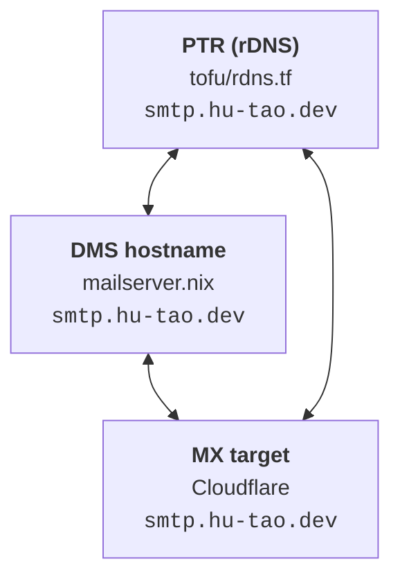

# TLS, DNS and mail

## One certificate

Certificates are `security.acme` (`acme.nix`): **one** certificate named
`hu-tao.dev`, with every `infra.certSubdomains` entry as a SAN, issued over
DNS-01 through Cloudflare. Because the certificate is _named_ after the apex
(not after the first domain, as certbot does), reordering the SAN list cannot
silently issue a second lineage under a new name.

- caddy does **not** manage certificates. It reads the acme directory
  read-only; each site names its files explicitly (`tls fullchain.pem key.pem`),
  which turns off caddy's own management. NixOS names the key `key.pem`, not
  certbot's `privkey.pem`.
- DNS-01 only touches `_acme-challenge` TXT records, so no name on the
  certificate needs an A record or a reachable port 80 — which is why the apex
  itself can be on it, and why the tailnet-only names are ordinary SANs.
- The cert directory is group-owned by `caddy` (not `acme`), so the
  unprivileged caddy container reads it by group membership rather than by
  `CAP_DAC_OVERRIDE`, which it drops. `reloadServices` restarts caddy and the
  mailserver after a renewal.
- **Every site emits HSTS.** Caddy adds nothing of the sort on its own, and
  until it was added no vhost here carried it. What it buys is the _first_
  request: every name is https-only and caddy already redirects `http`→`https`,
  but that redirect is a plaintext round trip an attacker on the path can answer
  instead — sslstrip against `mail.`'s login form, say. Tailnet sites carry it
  too; the plaintext redirect block deliberately does **not**, because a browser
  ignores HSTS on a plaintext response. No `preload`: that is a submission to a
  list baked into browser binaries, removal takes months, and it would bind the
  apex and therefore names this caddy does not serve.

The ACME account contact is `infra.acmeEmail`, and it is `ivan@hu-tao.dev` —
the mailserver this repo runs. It used to be `ivan@hu-tao.org`, a Google-hosted
mailbox nothing here describes, so expiry warnings were arriving somewhere this
repo knows nothing about. **Changing it registers a new ACME account**: lego
keys its account directory by contact address, so the next renewal registers
afresh rather than updating the existing registration. Issuance is unaffected.
Three things follow that option — `security.acme.defaults.email`, dozzle's
admin record, and `var.caa_iodef` in tofu, which is a separate default that has
to be kept equal by hand.

## Who may issue — CAA

Without a CAA record, **any** of the ~150 CAs in the public trust stores may
issue a certificate for `hu-tao.dev`, and a misissuance is a valid certificate
for this domain in someone else's hands. DNSSEC does not help: a certificate is
not a DNS answer, so signing the zone says nothing about who may sign for its
name.

**The list came from the live certificates, not from `acme.nix`.** Three
issuance paths feed this zone and only one of them is this server — which is
exactly the shape of mistake that makes CAA dangerous, because a record that
omits a real issuer breaks renewals _silently_, roughly 30 days before an
expiry:

| CA                | Who uses it                                                                                                                                |
| ----------------- | ------------------------------------------------------------------------------------------------------------------------------------------ |
| `letsencrypt.org` | lego on the VPS over DNS-01 — **and** Netlify, which serves the apex (`75.2.60.5` / `99.83.231.61`) and also issues through Let's Encrypt  |
| `pki.goog`        | Cloudflare Universal SSL. `www` is a **proxied** CNAME, so Cloudflare terminates TLS at its own edge, currently with Google Trust Services |

Plus an `iodef` pointing at `mailto:ivan@hu-tao.dev` — the only way these
records ever report that someone tried.

No `issuewild` records are published from here, deliberately: RFC 8659 makes
`issue` govern wildcard issuance when no `issuewild` is present, and the
tempting hardening — `issuewild ";"` to forbid wildcards outright — would break
that Cloudflare edge certificate, because it _is_ a wildcard.

### Read the result honestly

**Cloudflare publishes CAA records of its own** when it is the DNS provider, so
that Universal SSL stays renewable, and they never appear in a plan. Measured
immediately after the apply on 2026-09-20, eight appeared alongside the three
tofu owns, and the zone now answers:

```text
issue      comodoca.com, digicert.com, letsencrypt.org, pki.goog, ssl.com
issuewild  the same five
iodef      mailto:ivan@hu-tao.dev
```

So issuance went from roughly 150 CAs to **five, not to one**. That is a real
reduction and a modest one, and it is the ceiling for as long as anything in
this zone is proxied — the three records tofu publishes cannot narrow past what
Cloudflare adds back. The only route to the tighter list is to stop needing
Universal SSL at all: un-proxy `www`, which today is a 301 to an apex Netlify
serves anyway. That is a website decision rather than a security one.

`dig CAA hu-tao.dev` is the truth; the resource in `tofu/` is only the part
tofu owns.

## DNSSEC

Signing was switched on in the Cloudflare dashboard long before tofu knew about
it, and sat **pending** because the DS record was never published at the
registrar — a signed zone with no chain to the root is an unsigned zone with
extra steps. The DS is now published and the chain validates:

```sh
dig +dnssec @1.1.1.1 hu-tao.dev SOA | grep -E '^;; flags:.* ad'
dig +dnssec @8.8.8.8 hu-tao.dev SOA | grep -E '^;; flags:.* ad'
```

`tofu output dnssec_ds` prints the half a human pastes into the registrar. That
half cannot be automated — Hostinger ships no OpenTofu provider for domain
management — and it does not need to be: a DS is write-once for the life of the
zone.

`cloudflare_zone_dnssec.main` is **adoption only**, and its `lifecycle` block is
the point. An apply that touches the resource puts key material back in play,
and a key rotation after the DS is published takes the whole domain dark for
validating resolvers — mail included. The block is what stops a stray diff from
becoming that action.

The new blind spot worth naming: **a broken DNSSEC chain is a whole-domain
outage that the monitoring cannot see.** `kuma-check` probes from the VPS, whose
resolver may not validate, so it would keep reporting green while the rest of
the internet gets SERVFAIL.

## Mail deliverability depends on three things agreeing

They are set in three different places, and nothing checks that they match:



The PTR belongs to the **primary IP**, not the server. That is what makes an IP
handover carry mail reputation to a new box with no DNS change — see
[Migration off Ubuntu](../history/migration.md).

- **SPF** is `-all` and hard-codes the IP.
- **DKIM**'s public half is published from `tofu/` while its private half is a
  sops secret mounted into DMS. The two must be halves of one key, or every
  recipient fails the signature.
- **DMARC** is `p=quarantine`.

SMTP/IMAP (25/465/587/993) are published **directly** — an MX must be reachable
at the host, so none of it can sit behind cloudflared. Only the webmail is
proxied, at `mail.`.

## The Cloudflare tokens

There are two, with different scopes, and confusing them produces a failure
that looks like nothing is wrong: `security.acme` falls back to a self-signed
certificate and starts its dependent services anyway, so caddy and DMS come up
serving a placeholder. The check is the issuer, not the reachability:

```sh
ssh -p 2222 hutao@<host> sudo cat /var/lib/acme/hu-tao.dev/cert.pem \
  | openssl x509 -noout -issuer
# want: issuer=C=US, O=Let's Encrypt ...
# bad:  issuer=CN=minica root ca ...   <- placeholder, DNS-01 failed
```

Test a token directly rather than by triggering ACME — Let's Encrypt caps
failed validations at 5 per account per hostname per hour, and lego burns one
per attempt:

```sh
curl -sS -H "Authorization: Bearer $TOKEN" \
  'https://api.cloudflare.com/client/v4/zones?name=hu-tao.dev'
```
