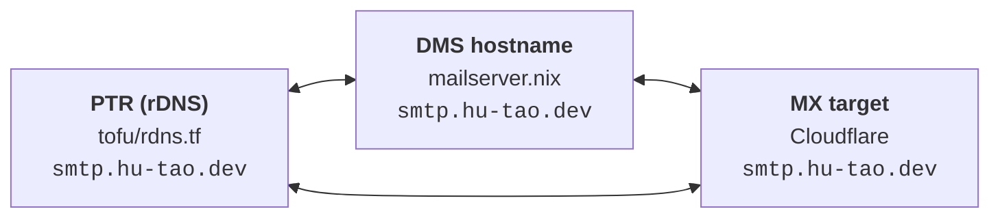

# TLS, DNS and mail

## One certificate

Certificates are `security.acme` (`acme.nix`): **one** certificate named
`hu-tao.dev`, with every `infra.certSubdomains` entry as a SAN, issued over
DNS-01 through Cloudflare. Because the certificate is _named_ after the apex
(not after the first domain, as certbot does), reordering the SAN list cannot
silently issue a second lineage under a new name.

- caddy does **not** manage certificates. It reads the acme directory
  read-only; each site names its files explicitly (`tls fullchain.pem key.pem`),
  which turns off caddy's own management. NixOS names the key `key.pem`, not
  certbot's `privkey.pem`.
- DNS-01 only touches `_acme-challenge` TXT records, so no name on the
  certificate needs an A record or a reachable port 80 — which is why the apex
  itself can be on it, and why the tailnet-only names are ordinary SANs.
- The cert directory is group-owned by `caddy` (not `acme`), so the
  unprivileged caddy container reads it by group membership rather than by
  `CAP_DAC_OVERRIDE`, which it drops. `reloadServices` restarts caddy and the
  mailserver after a renewal.

## Mail deliverability depends on three things agreeing

They are set in three different places, and nothing checks that they match:



The PTR belongs to the **primary IP**, not the server. That is what makes an IP
handover carry mail reputation to a new box with no DNS change — see
[Migration off Ubuntu](../history/migration.md).

- **SPF** is `-all` and hard-codes the IP.
- **DKIM**'s public half is published from `tofu/` while its private half is a
  sops secret mounted into DMS. The two must be halves of one key, or every
  recipient fails the signature.
- **DMARC** is `p=quarantine`.

SMTP/IMAP (25/465/587/993) are published **directly** — an MX must be reachable
at the host, so none of it can sit behind cloudflared. Only the webmail is
proxied, at `mail.`.

## The Cloudflare tokens

There are two, with different scopes, and confusing them produces a failure
that looks like nothing is wrong: `security.acme` falls back to a self-signed
certificate and starts its dependent services anyway, so caddy and DMS come up
serving a placeholder. The check is the issuer, not the reachability:

```sh
ssh -p 2222 hutao@<host> sudo cat /var/lib/acme/hu-tao.dev/cert.pem \
  | openssl x509 -noout -issuer
# want: issuer=C=US, O=Let's Encrypt ...
# bad:  issuer=CN=minica root ca ...   <- placeholder, DNS-01 failed
```

Test a token directly rather than by triggering ACME — Let's Encrypt caps
failed validations at 5 per account per hostname per hour, and lego burns one
per attempt:

```sh
curl -sS -H "Authorization: Bearer $TOKEN" \
  'https://api.cloudflare.com/client/v4/zones?name=hu-tao.dev'
```
