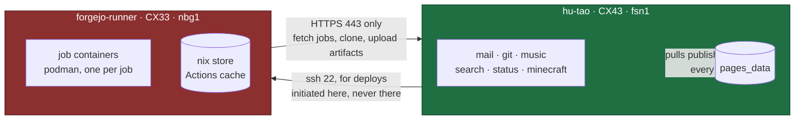

# Introduction

This is the whole of `hu-tao.dev`: a mail server, a Forgejo instance, a music
library, a search engine, two Minecraft worlds, a Discord bot, and the CI that
builds them — described by one flake, on two machines.

The guiding rule, stated once so the rest follows from it: **there is no state
on the server that this repo does not describe.** One flake builds each
machine; OpenTofu creates the machines and publishes their DNS. Anything a
human would otherwise have to remember to run is a systemd unit instead.

## The two machines

The green box holds everything. The red box is **treated as hostile** — it runs
code from pull requests, so the design assumes a job will one day escape its
container and get root there. What that costs is bounded by the split: a rooted
runner holds a nix store, a job cache and its own runner token, and can reach
exactly one thing on the VPS, over HTTPS, through an allow-list that permits
four URL paths. See [CI runner isolation](architecture/runner.md).

Both directions matter and only one is symmetric-looking. The runner reaches
`git.hu-tao.dev` the way any client on the internet does. The VPS reaches the
runner over ssh because it is the deploy host. There is no private network
between them, deliberately — there was one, it had a single member, and
[it was deleted](architecture/network.md#why-there-is-no-private-network).

## Where to start

| If you want to                            | Read                                                                                                     |
| ----------------------------------------- | -------------------------------------------------------------------------------------------------------- |
| understand how a packet reaches a service | [Network and trust boundaries](architecture/network.md)                                                  |
| know what runs here and how it is reached | [The service stack](architecture/services.md)                                                            |
| ship a change                             | [Deploying](operations/deploying.md)                                                                     |
| fix something that is broken now          | [Failure modes and recovery](operations/recovery.md)                                                     |
| install a machine from nothing            | [Provisioning a machine](operations/provisioning.md)                                                     |
| know why a thing is the way it is         | the module comment — every `modules/**.nix` opens with why it exists and which mistake it guards against |

That last row is not a deflection. This book is the index to those comments,
not a replacement for them: the reasoning lives next to the code it constrains,
where it cannot rot independently of it.

## Conventions used here

- **A "gotcha" has a date.** Anything described as learned the hard way names
  when, so a reader can tell a live constraint from a superstition.
- **Numbers are measured, not estimated**, and say where they came from.
- **Diagrams are mermaid**, in the markdown. They render in this book, in the
  Forgejo web UI, and in a pull request that changes one — so a diagram cannot
  quietly go stale behind a build step.
