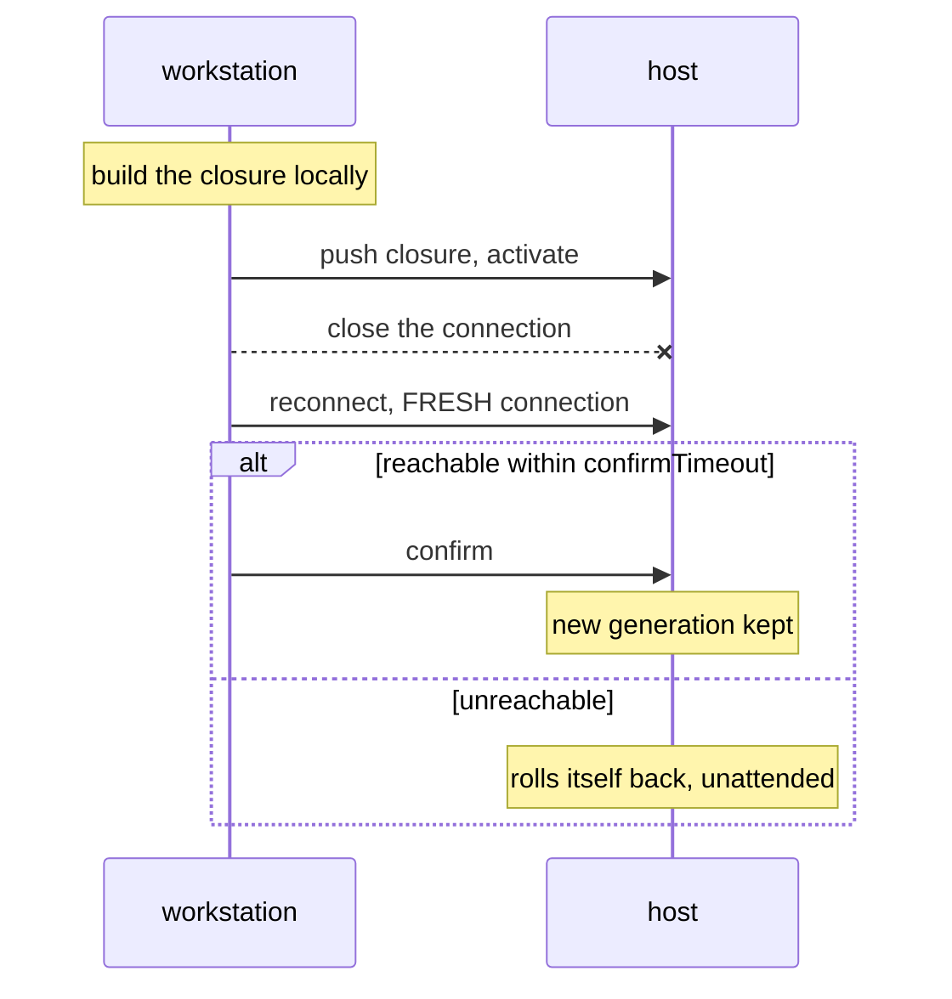

# Deploying

Two paths here, in order of how often you'll walk them: **redeploy**
(constantly) and **first deploy to an existing NixOS machine** (once per
machine). Installing onto hardware that has no NixOS at all is
[Provisioning](provisioning.md).

There are two deploy targets, and one of them is only reachable through the
other:

```sh
deploy .#vps              # the VPS
deploy .#runner-forgejo-runner   # the CI runner, via ProxyJump through the VPS
```

Everything below assumes the ssh key is loaded, because it is passphrase-
protected and nothing here can prompt for it:

```sh
ssh-agent -a /tmp/hutao-agent.sock >/dev/null 2>&1
SSH_AUTH_SOCK=/tmp/hutao-agent.sock ssh-add ~/.ssh/id_ed25519
export SSH_AUTH_SOCK=/tmp/hutao-agent.sock
```

A `Permission denied (publickey)` from any command here almost always means the
agent is gone, not that a key is missing on a server.

---

## 1. Redeploy — the everyday path

```sh
nix flake check          # optional; deploy builds anyway
deploy .#vps
```

Without deploy-rs — same result, no automatic rollback:

```sh
nix develop            # provides nixos-rebuild on a non-NixOS workstation
nixos-rebuild switch --flake .#vps-hetzner --target-host hutao@vps --use-remote-sudo
```

If deploy-rs itself ever becomes unavailable, note that an unresolvable flake
input stops the flake evaluating **at all** — so that fallback needs the input
removed from `flake.nix` first, not just a different command.

That is the whole thing. `deploy-rs` builds locally, pushes the closure,
activates it, then **waits for a fresh connection to confirm the box is still
reachable**. If it cannot reconnect, the machine rolls itself back to the
previous generation without being asked.

What it protects and what it does not:

| Failure                                           | Caught by                                |
| ------------------------------------------------- | ---------------------------------------- |
| firewall / sshd / networking change locks you out | **deploy-rs auto-rollback**              |
| unbootable kernel or initrd                       | GRUB generation menu, 5s timeout at boot |
| a container fails to start                        | _not_ auto-rolled back — see below       |

The last row is deliberate. deploy-rs confirms reachability, not service health.
A crashlooping container is visible and you still have ssh, so:

```sh
ssh -p 2222 hutao@hu-tao 'systemctl --failed; systemctl status docker-<name>'
ssh -p 2222 hutao@hu-tao 'sudo nixos-rebuild switch --rollback'
```

Rolling the whole system back because one container is unhappy is usually the
wrong reflex — fix it forward.



`confirmTimeout` is 120 s — long enough for every container to be recreated on
a config change, short enough that a hung activation is not an outage. The
activation timeout is 900 s, raised from 300 s for the serenity-bot image
build, which runs **inside** activation as a `Type=oneshot` unit. Measured on
this host on 2026-09-04, cold cache including the base image pulls: 3m28s.

### The runner is deployed through the VPS

The runner is deliberately off the tailnet, and inbound ssh is narrowed to the
VPS `/32` at **both** layers — its cloud firewall and its own nftables — so the
only route in is a jump:

```sh
deploy .#runner-forgejo-runner    # sshOpts carry -J vps
ssh -J vps root@46.225.61.172     # by hand
```

Magic rollback matters more here than anywhere: a mistake in
`modules/runner/firewall.nix` locks out the only path to the box, and the jump
host cannot help with that. Deploy the **VPS first and the runner last** when a
change touches both — the runner's route in is defined by the VPS's outbound
rules, so a VPS deploy that has not landed yet means a runner you cannot
reach.

**The jump hop hits Tailscale SSH.** `ProxyJump=vps` names no port, so it lands
on port 22, which `tailscaled` intercepts — and the policy's `check` rule opens
a browser for re-authentication before the jump is established. That is not a
misconfiguration, it is the rule working; the answer is cached for about 12
hours, so it fires once a day at most. The VPS's own deploy avoids it by going
to 2222 with an ordinary key, which is why that port is listed in the policy
and called deploy-critical there. See
[The tailnet policy](../architecture/tailnet.md#what-check-actually-checks).

### Ports and names, so nothing surprises you

- `hu-tao` is the **MagicDNS name**, which is why `deploy.nodes.vps.hostname` is
  a name and not an address. It survives the primary-IP handover during a
  migration, so the same command works before and after cutover.
- ssh is on **2222**. Port 22 belongs to forgejo, so that git clone URLs need no
  port. Going through Tailscale SSH instead would hit its interactive re-auth
  check, which cannot be scripted — hence port 2222 and a normal key.

### If a deploy fails with "lacks a signature by a trusted key"

`nix.settings.trusted-users` must include `@wheel` (it does, in
`modules/nix.nix`). If you ever deploy to a machine that predates that setting,
you cannot push to it — build on the box instead:

```sh
rsync -a --delete --exclude .git -e 'ssh -p 2222' ./ hutao@hu-tao:nixos-image/
ssh -p 2222 hutao@hu-tao 'cd nixos-image && sudo nixos-rebuild switch --flake .#vps-hetzner'
```

That is also the bootstrap for the very first deploy after an install.

---

## 2. First deploy to a machine that already runs NixOS

Same as a redeploy, with two one-time steps:

```sh
# 1. Trust the host key, or deploy-rs fails with "Host key verification failed"
#    and no way to answer the prompt.
ssh-keyscan -p 2222 -H hu-tao >> ~/.ssh/known_hosts

# 2. Confirm the box can decrypt its own secrets before relying on it.
ssh -p 2222 hutao@hu-tao 'sudo ls /run/secrets/ | wc -l'   # expect 20
```

Then `deploy .#vps`.

---

## What makes this automatic (and what used to break it)

Every item below is now in the config. They are listed because each one, when
missing, produces a machine that installs with no error and then does not work —
the worst failure shape there is.

| Setting                                                 | Where                  | Without it                                                                                                                                                                         |
| ------------------------------------------------------- | ---------------------- | ---------------------------------------------------------------------------------------------------------------------------------------------------------------------------------- |
| `boot.initrd.availableKernelModules` with **virtio**    | `modules/hardware.nix` | NixOS's default set is bare-metal only. The initrd cannot see `/dev/sda`, root never mounts, and the box sits in an emergency shell while the provider still reports it `running`. |
| **GRUB**, not systemd-boot                              | `modules/boot.nix`     | Hetzner Cloud boots legacy BIOS — there is no `/sys/firmware/efi`. systemd-boot installs cleanly and leaves an unbootable machine.                                                 |
| `efiInstallAsRemovable`, `canTouchEfiVariables = false` | `modules/boot.nix`     | There is no efivarfs in BIOS mode; bootloader installation fails outright if it tries to write NVRAM.                                                                              |
| `time.timeZone`                                         | `modules/boot.nix`     | Unset means NixOS does not manage `/etc/localtime`, so docker creates a _directory_ there and every container that bind-mounts it dies with "not a directory".                     |
| `nix.settings.trusted-users = @wheel`                   | `modules/nix.nix`      | `deploy-rs` cannot push: "lacks a signature by a trusted key".                                                                                                                     |
| ssh on **2222**                                         | `modules/services.nix` | Port 22 is forgejo's. Also needs a matching rule in the **Hetzner edge firewall**, which is separate from the host's nftables.                                                     |

**The VM test cannot catch any of these.** `nixos-anywhere --flake .#vps
--vm-test` validates disko, GRUB and that the system boots — genuinely useful,
and it is what proved GRUB-on-BIOS works. But the NixOS test harness injects its
own virtio modules and its own networking, so a config that boots in the test can
still be unbootable on real hardware. Treat a passing VM test as "the layout and
bootloader are sane", never as "this will boot on the server".

---

## Verifying a machine is actually healthy

Not "the deploy said success" — these:

```sh
ssh -p 2222 hutao@hu-tao '
  systemctl is-system-running          # want: running
  systemctl --failed                   # want: empty
  sudo ls /run/secrets | wc -l         # want: 21
  sudo docker ps --format "{{.Names}} {{.Status}}"
  for u in caddy forgejo mailserver webmail kuma navidrome minecraft minecraft2 grafana tempo dozzle \
           cloudflared serenity-bot-0 serenity-redis; do
    echo "$u restarts=$(systemctl show -p NRestarts --value docker-$u)"
  done
  systemctl is-active postgresql pgbouncer serenity-bot-image'
```

Non-zero `NRestarts` means a crashloop that `systemctl is-active` will happily
report as `active`, because systemd restarts it fast enough to look healthy.

And confirm the certificate is real rather than the self-signed placeholder that
`security.acme` installs when issuance fails — services start either way, so
nothing looks wrong until you check the issuer:

```sh
ssh -p 2222 hutao@hu-tao 'sudo cat /var/lib/acme/hu-tao.dev/cert.pem' \
  | openssl x509 -noout -issuer -enddate
# want: issuer=C=US, O=Let's Encrypt, ...
# bad:  issuer=CN=minica root ca ...   <- placeholder, DNS-01 failed
```

Before triggering ACME, test the Cloudflare token directly — Let's Encrypt caps
failed validations at 5 per hour and lego spends one per attempt:

```sh
ssh -p 2222 hutao@hu-tao 'sudo bash -c "
  T=\$(cat /run/secrets/cloudflare_api_token)
  curl -sS -H \"Authorization: Bearer \$T\" \
    https://api.cloudflare.com/client/v4/zones?name=hu-tao.dev"'
```

An empty `result` array with `success: true` means the token cannot see the zone
— which reads as success if you only check `.success`.

## If deploy-rs ever disappears from GitHub

The risk is bigger than losing `deploy`: flake inputs are fetched from source,
not from the binary cache, so an unresolvable input means **the flake stops
evaluating entirely** and `nixos-rebuild --flake` fails too.

Three mitigations, in order of effort:

1. **Nothing breaks while the store path is present.** A locked input already
   realised in `/nix/store` is not refetched. `nix flake archive` copies every
   input into the store on purpose, and `nix-store --gc` is what would remove
   them again.
2. **Keep a copy**: `nix flake archive --to file:///path/to/mirror` writes all
   inputs somewhere you control.
3. **Cut it out** — a three-part edit to `flake.nix`, after which option 2 above
   is the only deploy path:
   - delete the `deploy-rs` entry from `inputs`
   - delete `deploy-rs` from the `outputs = { ... }` argument list
   - delete the `deploy` and `checks` outputs, and `deploy-rs.packages.${system}.default`
     from the devShell

   Nothing in `modules/` references it, so the machine configuration itself is
   unaffected.
