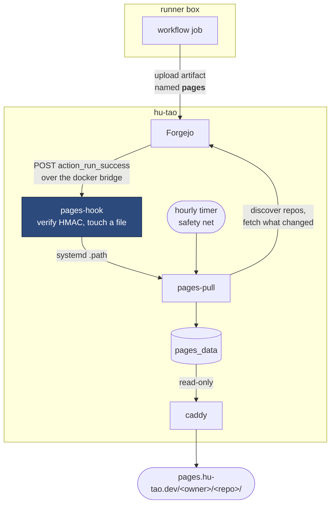

# Pages

`pages.hu-tao.dev` is a static site caddy serves out of one docker volume.
**The URL layout is the directory layout**, with no rewriting anywhere:

```text
<pages_data>/<owner>/<repo>/index.html   →   https://pages.hu-tao.dev/<owner>/<repo>/
```

This book is published that way, at
`https://pages.hu-tao.dev/hutao/vps/docs/`.

## The direction reversed

A publishing job used to mount the `pages_data` volume and write into it —
that is what the old in-container runner's one-entry `valid_volumes` allow-list
was for. A runner on its own box cannot do that, and must not: it would be the
runner reaching into the VPS, which is the one thing the split forbids.

So the job uploads an artifact and the VPS fetches it.



An hourly timer starts `pages-pull` as well, and that is a safety net rather
than the mechanism — see [When it runs](#when-it-runs).

**Every connection is initiated on the VPS**, and in fact never leaves the host
— the artifact is in Forgejo's own storage, in a container on the same box.

**The workflow runs on `main` only.** An earlier version built on pull requests
and gated the upload step with `if: push && main` instead, which meant the
riskiest step was skipped in every rehearsal: the branch introducing the
workflow went green having never once run it, and the failure landed on `main`
at merge. Gate the workflow, not the step.

**No credential.** The publishing repos are public and Forgejo serves
`/api/v1/repos/<owner>/<repo>/actions/artifacts` anonymously (verified
2026-09-19 against the live instance: 200 with a bare JSON array body). The day
a private repo publishes, this needs a sops token with `read:repository` — and
not before. Do not add one speculatively.

**Not a `gh-pages` branch**, which would be the idiomatic shape. That needs
`git-receive-pack`, which caddy now **denies** to runner addresses: the
allow-list carries `info/refs` and `git-upload-pack` and nothing else, so a
runner can clone and cannot push. Artifacts ride the twirp `ArtifactService`
instead, sidestepping the need entirely. See
[CI runner isolation](../architecture/runner.md#why-layer-5-exists).

## Adding a repo

**One thing:** give the repo a workflow that uploads an artifact named exactly
`pages`. That is the whole of it. Nothing is added to this repo, and no deploy
is run.

`pages-pull` enumerates every repo on the instance through
`/api/v1/repos/search` and publishes any that holds a live artifact by that
name. Uploading it is the opt-in, the same way enabling Pages is a repo-level
act rather than something the hosting provider does for you.

It was not always so. There used to be an `infra.pagesRepos` list in
`modules/options.nix`, so adding a page meant a commit here and a
`deploy .#vps` — a rebuild of the machine that serves mail, in order to publish
a static site. The list existed because of a misreading of the runner split:
the note said the pull side "has to be told what to look for", when it only has
to be told how to find out.

Two things fall out of the change:

- **A repo that has never published is not a special case.** It has no `pages`
  artifact, so it is not discovered, and nothing is logged. Under the list this
  was a repo you had named in error and worth a line in the journal; now it is
  simply most of the instance.
- **A renamed or deleted repo stops being discovered.** The old list had to be
  edited by hand when that happened, or the unit failed every five minutes
  forever — `hutao/critical-forest` was carried as a comment explaining exactly
  that. The served tree is still left in place, so caddy keeps answering that
  path until someone removes it.

An **empty discovery is treated as an error**, not as "no repos publish". This
instance always has repos, so zero means the search endpoint moved or started
refusing us — and the damage would be every published site silently freezing at
its current content while the unit kept exiting 0.

## The artifact is untrusted content

It was built on the [CI runner](../architecture/runner.md), the machine this
estate treats as hostile. Layers 1–5 over there are address-and-port-and-path
controls; **an artifact is the one thing that crosses the boundary carrying
content**, and the caddy allow-list has to admit the `ArtifactService` route or
publishing does not work at all.

So `pages-pull` deletes every symlink out of the unpacked tree before anything
is pointed at it:

```sh
unzip -q "$tmp/pages.zip" -d "$tmp/out"
find "$tmp/out" -type l -delete
```

Info-ZIP already refuses the two obvious escapes — it strips `../`, it warns
`stripped absolute path spec from /x`, and it will not write _through_ a
symlink. What it does do is **restore** one, target and all, and the `cp -a`
that follows preserves it. That is enough on its own, because caddy's
`file_server` follows a symlink out of its root, and `modules/acme.nix`
group-owns the certificate directory _by caddy_ so that caddy can read
`key.pem`. One `ln -s /etc/caddy/certs/key.pem x` in a published artifact would
otherwise serve the apex certificate's private key — and every one of its
eleven SANs — at `https://pages.<domain>/<owner>/<repo>/x`.

A published site is files and directories; a symlink in one has no legitimate
use here. They are **deleted rather than rejected** so that one malformed
artifact cannot wedge a repo's publishing, and `-type l` matches the link
itself and never its target, so this cannot follow a link out of `$tmp`.

`checks.pages-pull-strips-symlinks` holds it: it asserts the strip sits between
the unzip and the copy, and then `eval`s **that exact line** — lifted out of the
evaluated unit, not retyped — against a tree unpacked from a hostile zip built
in the check.

## When it runs

A **Forgejo system webhook** on `action_run_success`, so publishing is an event
rather than a poll. The whole path is:

|          |                                                                                                |
| -------- | ---------------------------------------------------------------------------------------------- |
| trigger  | one system hook in Site Administration, firing for every repo on the instance                  |
| target   | `http://<dockerBridgeGateway>:<pagesHookPort>/hooks/pages-pull`                                |
| auth     | HMAC-SHA256 over the body, read from `X-Hub-Signature-256`                                     |
| receiver | `modules/pages-hook.nix` — `webhook(1)` in a container on the proxy network, no published port |
| effect   | touches one file; a systemd `.path` unit starts `pages-pull` as root                           |

**It never leaves the proxy network.** Both Forgejo and the receiver are
containers on it, so the delivery is container-to-container. There is no caddy
site, no published port, no public listener — and no firewall rule at all,
because the port never exists on the host.

That is also the correction to an earlier claim here: this used to say a
webhook cost "an HTTP receiver on the mail server, which is not a trade worth
making". It assumed the receiver had to be public.

**A system hook, not a per-repo hook.** Per-repo would reintroduce exactly the
per-repo setup step that discovery removed. One hook covers everything,
including repos that do not exist yet.

**The receiver parses nothing.** Any successful Action Run pokes `pages-pull`,
which is idempotent and cheap. Reading the payload would trade a slightly
smaller number of no-op runs for a coupling to Forgejo's `ActionPayload`
schema.

**The listener holds no privilege.** It runs as its own uid from
`modules/ids.nix`, with a read-only rootfs and every capability dropped, and
its entire capability is touching one file in a bind-mounted directory; the
`.path` unit does the privileged half. A network-facing process that can run
`systemctl start` is a network-facing process that is root-adjacent.

**The hourly timer stays**, and is now a safety net rather than the mechanism.
A webhook is a delivery and deliveries are lost — the receiver can be down
mid-deploy, Forgejo's retries can run out, the hook can be switched off in a
web form nothing here can see. Each of those leaves a site frozen with no error
anywhere. The sweep makes the worst case "stale for up to an hour".

### Forgejo has to be told the destination is allowed

`ALLOWED_HOST_LIST` defaults to `external`, which permits public addresses and
**blocks private ones** — so out of the box Forgejo refuses to deliver and the
webhook silently never fires. `modules/containers/forgejo.nix` sets it to
`pages-hook`.

**The container name, not an address, and that is the security-relevant part.**
The list matches _hosts, not host:port_. While the receiver ran on the host,
this had to name `172.17.0.1` — which also permitted a webhook aimed at
anything else bound there, and grafana (3000), syncthing's GUI (8384), tempo
(4317/4318) and pgbouncer (6432) all bind `0.0.0.0` and answer on it. Forgejo
webhooks can use `GET` and record the **response body** in their delivery
history, so that was a read primitive with an exfiltration channel: whoever
could create a webhook could read tailnet-only services without being on the
tailnet.

A name works because the matcher is `MatchHostName(host) || MatchIPAddr(ip)` —
a name pattern alone is sufficient, so no private address needs allowing and
`172.17.0.1` stops matching at all. One destination, nothing else.

The failure mode is worth knowing because everything on the RECEIVING side
looks correct while it happens: the socket is listening, the rule matches, and
there is no dropped packet, no connection refused and nothing in the receiver's
journal — because nothing is ever sent.

Look at the sender instead. Forgejo logs the refusal as an error on its own
service:

```sh
journalctl -u docker-forgejo | grep -i 'unable to deliver webhook'
```

and the hook's settings page shows the same thing under Recent deliveries.

### The one hand-kept value

The hook's Target URL and secret live in a web form, so nothing in this repo
can verify they match `infra.pagesHookPort` and
`forgejo/system_webhooks/pages_pull/secret`. A mismatch
is at least loud in two places: a 403 in `journalctl -u pages-hook`, and a
failed delivery in the hook's own history in Site Administration.

## Failure isolation

Each repo runs in its own subshell, so one bad repo — renamed, deleted, made
private, a network blip, a corrupt zip — cannot take down the rest of the loop.
A transient failure heals itself on the next tick; a **persistent** one is the
failure worth guarding against, because left unguarded it would permanently
block every repo listed after it, and silently: the unit "succeeding" on the
repos before the broken one looks no different from everything being fine.

So the loop logs it, keeps going, and fails the unit at the end. `failed` is
**set, not incremented** — whether it was one repo or all of them, the answer
is "look at the journal", not a count.

```sh
journalctl -u pages-pull --since -1h
systemctl list-timers pages-pull
```

## Checking it worked

```sh
curl -sSI https://pages.hu-tao.dev/hutao/vps/docs/ | head -1
```
