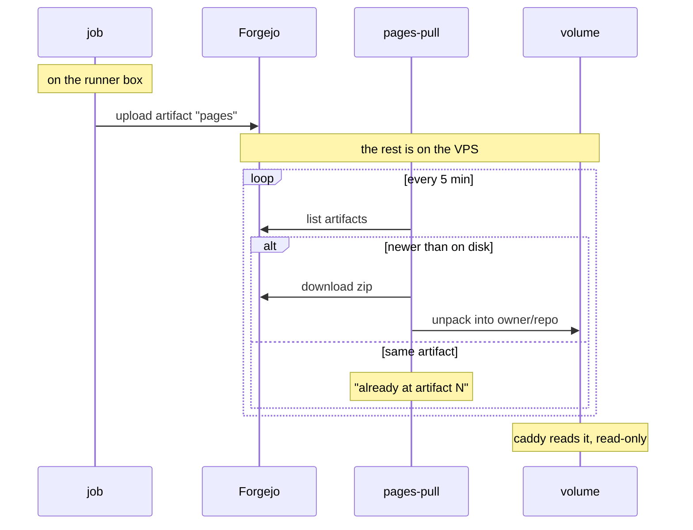

# Pages

`pages.hu-tao.dev` is a static site caddy serves out of one docker volume.
**The URL layout is the directory layout**, with no rewriting anywhere:

```text
<pages_data>/<owner>/<repo>/index.html   →   https://pages.hu-tao.dev/<owner>/<repo>/
```

This book is published that way, at
`https://pages.hu-tao.dev/hutao/vps/docs/`.

## The direction reversed

A publishing job used to mount the `pages_data` volume and write into it —
that is what the old in-container runner's one-entry `valid_volumes` allow-list
was for. A runner on its own box cannot do that, and must not: it would be the
runner reaching into the VPS, which is the one thing the split forbids.

So the job uploads an artifact and the VPS fetches it.



**Every connection is initiated on the VPS**, and in fact never leaves the host
— the artifact is in Forgejo's own storage, in a container on the same box.

**The workflow runs on `main` only.** An earlier version built on pull requests
and gated the upload step with `if: push && main` instead, which meant the
riskiest step was skipped in every rehearsal: the branch introducing the
workflow went green having never once run it, and the failure landed on `main`
at merge. Gate the workflow, not the step.

**No credential.** The publishing repos are public and Forgejo serves
`/api/v1/repos/<owner>/<repo>/actions/artifacts` anonymously (verified
2026-09-19 against the live instance: 200 with a bare JSON array body). The day
a private repo publishes, this needs a sops token with `read:repository` — and
not before. Do not add one speculatively.

**Not a `gh-pages` branch**, which would be the idiomatic shape. That needs
`git-receive-pack`, which caddy now **denies** to runner addresses: the
allow-list carries `info/refs` and `git-upload-pack` and nothing else, so a
runner can clone and cannot push. Artifacts ride the twirp `ArtifactService`
instead, sidestepping the need entirely. See
[CI runner isolation](../architecture/runner.md#why-layer-5-exists).

## Adding a repo

**One thing:** give the repo a workflow that uploads an artifact named exactly
`pages`. That is the whole of it. Nothing is added to this repo, and no deploy
is run.

`pages-pull` enumerates every repo on the instance through
`/api/v1/repos/search` and publishes any that holds a live artifact by that
name. Uploading it is the opt-in, the same way enabling Pages is a repo-level
act rather than something the hosting provider does for you.

It was not always so. There used to be an `infra.pagesRepos` list in
`modules/options.nix`, so adding a page meant a commit here and a
`deploy .#vps` — a rebuild of the machine that serves mail, in order to publish
a static site. The list existed because of a misreading of the runner split:
the note said the pull side "has to be told what to look for", when it only has
to be told how to find out.

Two things fall out of the change:

- **A repo that has never published is not a special case.** It has no `pages`
  artifact, so it is not discovered, and nothing is logged. Under the list this
  was a repo you had named in error and worth a line in the journal; now it is
  simply most of the instance.
- **A renamed or deleted repo stops being discovered.** The old list had to be
  edited by hand when that happened, or the unit failed every five minutes
  forever — `hutao/critical-forest` was carried as a comment explaining exactly
  that. The served tree is still left in place, so caddy keeps answering that
  path until someone removes it.

An **empty discovery is treated as an error**, not as "no repos publish". This
instance always has repos, so zero means the search endpoint moved or started
refusing us — and the damage would be every published site silently freezing at
its current content while the unit kept exiting 0.

## Failure isolation

Each repo runs in its own subshell, so one bad repo — renamed, deleted, made
private, a network blip, a corrupt zip — cannot take down the rest of the loop.
A transient failure heals itself on the next tick; a **persistent** one is the
failure worth guarding against, because left unguarded it would permanently
block every repo listed after it, and silently: the unit "succeeding" on the
repos before the broken one looks no different from everything being fine.

So the loop logs it, keeps going, and fails the unit at the end. `failed` is
**set, not incremented** — whether it was one repo or all of them, the answer
is "look at the journal", not a count.

```sh
journalctl -u pages-pull --since -1h
systemctl list-timers pages-pull
```

## Checking it worked

```sh
curl -sSI https://pages.hu-tao.dev/hutao/vps/docs/ | head -1
```
