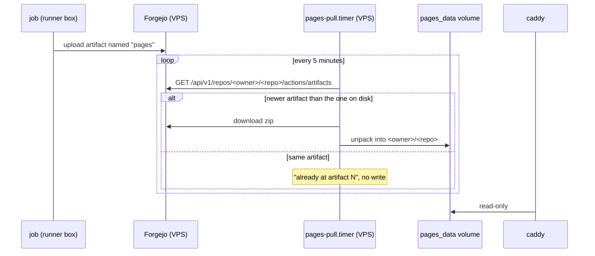

# Pages

`pages.hu-tao.dev` is a static site caddy serves out of one docker volume.
**The URL layout is the directory layout**, with no rewriting anywhere:

```text
<pages_data>/<owner>/<repo>/index.html   →   https://pages.hu-tao.dev/<owner>/<repo>/
```

This book is published that way, at
`https://pages.hu-tao.dev/hutao/vps/docs/`.

## The direction reversed

A publishing job used to mount the `pages_data` volume and write into it —
that is what the old in-container runner's one-entry `valid_volumes` allow-list
was for. A runner on its own box cannot do that, and must not: it would be the
runner reaching into the VPS, which is the one thing the split forbids.

So the job uploads an artifact and the VPS fetches it.



**Every connection is initiated on the VPS**, and in fact never leaves the host
— the artifact is in Forgejo's own storage, in a container on the same box.

**No credential.** The publishing repos are public and Forgejo serves
`/api/v1/repos/<owner>/<repo>/actions/artifacts` anonymously (verified
2026-09-19 against the live instance: 200 with a bare JSON array body). The day
a private repo publishes, this needs a sops token with `read:repository` — and
not before. Do not add one speculatively.

**Not a `gh-pages` branch**, which would be the idiomatic shape. That needs
`git-receive-pack`, which caddy now **denies** to runner addresses: the
allow-list carries `info/refs` and `git-upload-pack` and nothing else, so a
runner can clone and cannot push. Artifacts ride the twirp `ArtifactService`
instead, sidestepping the need entirely. See
[CI runner isolation](../architecture/runner.md#why-layer-5-exists).

## Adding a repo

Two things, and both are required:

1. Add `<owner>/<repo>` to `infra.pagesRepos` in `modules/options.nix`. The
   pull side has to be told what to look for — while the runner wrote the
   volume directly, the set was simply "whatever had ever run the job", and
   nothing had to know.
2. Give the repo a workflow that uploads an artifact named exactly `pages`.

A repo listed there that has never uploaded a `pages` artifact is **not** an
error: the unit logs `no live pages artifact` and leaves any existing tree
alone, which is also what it does for a repo whose artifacts have aged out.

A repo that genuinely disappears belongs **out** of the list. `hutao/critical-forest`
is deliberately absent even though the volume still holds a tree for it: the
repo 404s under both owners, so it was renamed or deleted, and a name that
cannot resolve would fail the unit every five minutes forever. The served tree
is left in place — caddy keeps answering that path.

## Failure isolation

Each repo runs in its own subshell, so one bad repo — renamed, deleted, made
private, a network blip, a corrupt zip — cannot take down the rest of the loop.
A transient failure heals itself on the next tick; a **persistent** one is the
failure worth guarding against, because left unguarded it would permanently
block every repo listed after it, and silently: the unit "succeeding" on the
repos before the broken one looks no different from everything being fine.

So the loop logs it, keeps going, and fails the unit at the end. `failed` is
**set, not incremented** — whether it was one repo or all of them, the answer
is "look at the journal", not a count.

```sh
journalctl -u pages-pull --since -1h
systemctl list-timers pages-pull
```

## Checking it worked

```sh
curl -sSI https://pages.hu-tao.dev/hutao/vps/docs/ | head -1
```
