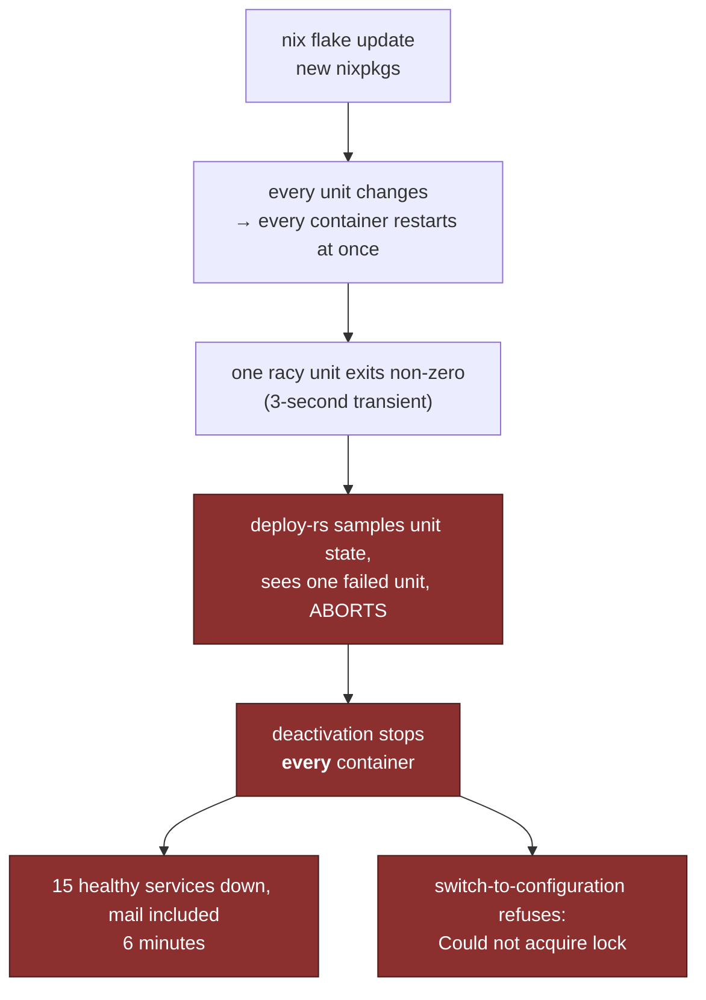

# Failure modes and recovery

The design is shaped by which failures roll back automatically and which do
not. This page is the table of both, and then the three that are recent scars.

| Failure                                                                    | Caught by                                                                      | Recovery                                                                                          |
| -------------------------------------------------------------------------- | ------------------------------------------------------------------------------ | ------------------------------------------------------------------------------------------------- |
| firewall / sshd / networking change locks you out                          | **deploy-rs auto-rollback**                                                    | automatic                                                                                         |
| unbootable kernel / initrd                                                 | GRUB generation menu (5 s at boot)                                             | pick the previous generation                                                                      |
| a container fails to start                                                 | nothing — deploy confirms reachability, not health                             | `nixos-rebuild --rollback` or fix forward                                                         |
| `nftables` reload wiped docker's chains                                    | nothing automatic; the symptom is the _next_ container start failing           | `systemctl restart docker`, and keep `flushRuleset = false`                                       |
| a rotated sops secret didn't reach a container                             | nothing — the container holds a stale inode                                    | copy-to-stable-path or env-file, see [Secrets](../architecture/secrets.md#the-stale-symlink-trap) |
| tofu plan shows an unexpected diff on unchanged infra                      | you, reading the plan                                                          | **the state is wrong, not the infra** — never `apply`; `refresh`/`import`, verify on the box      |
| a fail2ban jail bans a docker/bridge address                               | nothing — a forward-chain `reject` on an internal IP downs **every** container | `systemctl stop fail2ban`; keep private ranges in `ignoreIP`                                      |
| a deploy restarts every container at once and one racy unit exits non-zero | **deploy-rs aborts** — and its deactivation stops every container              | see [the abort that was worse than the failure](#the-abort-that-was-worse-than-the-failure)       |

## The fail2ban blast radius

A forward-chain fail2ban jail has a blast radius the size of the whole box. If
it ever bans an internal source it rejects **all** forwarded traffic, not one
attacker — every container goes dark at once.

That is why `search.` is rate-limited **in caddy** rather than banned in
nftables: an in-process limiter can only throttle, it cannot take the forward
plane down. See [Access control](../architecture/access-control.md).

Before adding any forward-chain jail, ask what happens when it bans
`172.30.0.x`.

## The abort that was worse than the failure

The least intuitive row, and the widest. **A failed activation does not leave
the box on the previous generation _running_.** It leaves it on the previous
generation's _configuration_, with nothing started.



On 2026-09-16 a three-second transient in one non-critical container therefore
cost fifteen healthy services, mail included, for six minutes. **The abort was
more destructive than the failure it was responding to.**

Recovery, in order:

```sh
systemctl restart docker
# then start the container units by hand — switch-to-configuration will refuse
# with "Could not acquire lock" while deploy-rs still holds it
```

The structural fix is to order fragile units behind a readiness gate rather
than letting them race the restart. Full writeup:
[2026-09-16 — flake update rollback](../history/postmortems/2026-09-16-flake-update-rollback.md).

## tofu state recovery

State is gitignored — it holds every value tofu has ever read. A clone has
none, and `apply` from no state builds a **second** server and moves DNS to it.

`tofu/imports.tf` prevents that declaratively: an `import` block per live
resource, inert while state tracks it, active when it does not. `tofu init &&
tofu plan` then rebuilds state.

A correct recovery plan reads **`20 to import, 0 to add, 1 to change, 0 to
destroy`** — the one change being three provider-side booleans on
`hcloud_server.vps` that the importer never sets. **Anything else means stop.**

> **The sharp edge (learned the hard way, 2026-09-05):** the hcloud provider
> never reads `public_net` into state, so a post-import plan proposes _adding_
> it — and on this resource that detaches the primary IPs before reattaching.
> Applying it once took the mail IP off a running host. `server.tf` now carries
> `lifecycle.ignore_changes = [public_net]`, so the block can never become an
> action. The primary IP is its own resource with delete protection precisely
> so a mistake here is minutes of downtime rather than a lost address.

A plan that disagrees with what you know to be true is a **state** problem, not
an infrastructure problem. Never reach for `apply` to make it agree.

## Runner-specific failures

| Symptom                                             | Cause                                                     | Fix                                                                                                                              |
| --------------------------------------------------- | --------------------------------------------------------- | -------------------------------------------------------------------------------------------------------------------------------- |
| jobs queue and never start                          | the runner cannot reach Forgejo, or its identity is wrong | `ssh -J vps root@<runner>`, then `journalctl -u gitea-runner-forgejo`                                                            |
| `403 not permitted from a CI runner` in a job       | the workflow hit a path outside the four-path allow-list  | widen the allow-list deliberately, or change the workflow — see [runner isolation](../architecture/runner.md#why-layer-5-exists) |
| `upload-artifact` fails with no HTTP request at all | GitHub's action, not the Forgejo fork                     | `forgejo/upload-artifact@v5`                                                                                                     |
| you cannot ssh to the runner                        | its route in is defined by the **VPS's** outbound rules   | deploy the VPS first; the runner has no tailnet and no other path                                                                |

A runner that is broken past recovery is **replaced, not repaired** — it holds
a nix store and a job cache and nothing else. Rebuild in place, never destroy
and recreate: CX instance types are limited availability.
